# Donor System Map — Phase 1 ownership snapshot 2026-09-03

This map describes observed donor ownership/coupling and the intended transfer boundary. It is not a claim that any subsystem has been ported.

## Current runtime ownership summary

- `MSC.Core`, `MSC.Bootstrap`, stable IDs and registries own the independent
  runtime composition and identity boundary.
- `MSC.World` owns project streaming/registries; legacy scenes own temporary
  static presentation and collision only.
- `MSC.Player` and `MSC.Interaction` own intent, movement and explicit
  capabilities; donor controllers do not run.
- `MSC.Vehicle` owns assembly/simulation/NWH integration; the Satsuma slice is
  Partial and its current green generated baseline is `11A-V1d.60`: 125 loose
  parts, 117 mounts, 280 fasteners, four operable body hinges and a `39/39`
  generated-content gate.
- `MSC.Save` owns native document v16, slots, recovery, migrations and 14
  current-domain participants. It does not import or execute donor save logic.
- project time/weather/wetness/lightning remain authoritative; Enviro 3 is a
  presentation adapter.
- `IAudioBackend` remains the gameplay boundary; Wwise and Unity fallback are
  presentation backends.
- the 08A UI is project-owned and consumes real capabilities where available;
  it never makes an absent gameplay domain complete.
- no complete runtime ownership root currently exists for Jobs, Authority,
  Rally, Media, Progression or general Communications. Their donor evidence is
  mapped, but gameplay authority remains unimplemented.

Current status evidence:
`Docs/Reviews/FULL_GAME_PARITY_AUDIT_2026-09-02.md`.

Streamed persistent physics, 2026-09-02: base cell scenes own static collision,
while `world.entities` owns ordinary/persistent pickup Rigidbody state and
`vehicle.satsuma` exclusively owns chassis plus all `PartInstance` physics.
Presentation layers own neither. `OwnedSceneWillUnload` is the guard boundary;
base-cell registration completion is the release boundary. A startup static
refresh precedes native restore and a second refresh follows restored player
focus. Below-world recovery changes pose only for the aggregate, `Loose` parts
and explicitly critical items; assembly lifecycle, mounts, fasteners, NWH and
stable identities remain authoritative and unchanged.

Rear spring removal V1d.46 is a corner-specific assembly dependency. In the
donor, each stock and rally/long spring Removal FSM reads the `Installed` state
of both compatible shocks on its own rear corner before enabling mouse-over and
remove. The remake maps that relationship to
`MountPointDefinition.RemovalBlockedWhileOccupiedMountIds`, resolved from the
part's actual occupied mount. It intentionally does not make shock installation
depend on a spring, and does not use a global part-definition dependency that
could couple interchangeable left/right instances. The normal installed-part
capability hides removal UI for this `RemovalBlocked` state while retaining the
proxy used by tool and mount-handoff interactions.

Installed-part removal UI V1d.45 consumes the existing assembly authority
rather than inventing a second fastening state. While
`FastenerGroupState.IsBolted` is latched, the installed part's removal
capability reports non-interactable; `InteractionCandidate` emits no removal
prompt and the prompt-driven outline presenter clears its outline. The direct
2026-09-02 UI correction makes that capability mirror
`EvaluateRemoval(...).Succeeded` for every current refusal, including a bolted
latch, installed dependency and physical obstruction. Installed parts also
clear their target-title metadata; loose parts restore it after detachment.
The interaction proxy remains active for nested mount handoff, while separate
fastener/tool and hinged open/close capabilities report their own live
availability. This is a project-owned presentation policy over transferred
BoltCheck configuration, not a claim that the donor uses the same HUD or
outline.

Operable body panels V1d.58 remain ordinary assembly parts, but their installed
physics authority is a real `HingeJoint` rather than generic mount-transform
synchronization. The generated hinge profile transfers the donor pivot, axis,
limits and asymmetric LMB/RMB torque for both doors, bootlid and hood. Audited
donor break values stay on the authoring profile as evidence; they are not fed
raw into Unity 6, where ordinary chassis constraint impulses could destroy the
joint and deactivate the panel. `AssemblyHingedPartInteractionTarget` applies
torque only while held,
retains Rigidbody inertia after release, ignores only connected-chassis solid
pairs and leaves world obstruction active. A donor-strength `FixedJoint`
latches only at the one-degree physical endpoint; that narrow threshold is a
documented correction to the donor FSM's visible roughly-ten-degree snap. All
four panels have four staged fasteners and fully detach only when completely
unfastened and held through full opening. The hood's opening additionally
depends on the dashboard `AssemblyHoodReleaseInteractionTarget`. No `F` toggle
or donor FSM runtime is present.

The fastened bootlid has a second, donor-exact endpoint state: at full opening
its `HingeJoint` limits narrow from `-70..0` to `-70..-69` degrees. Closing
input restores the full travel before torque resumes. This holds the open lid
without deleting inertia during partial travel or inventing a second latch.

Bootlid presentation V1d.60 retains three otherwise easy-to-lose donor hierarchy
effects. Its four visible bolts inherit a `0.5` source `BoltPM` Z-scale, so an
eight-stage screw travel is `10 mm` rather than the erroneous `20 mm`; and the
donor-active `bootlid_emblem` / `datsun_bootlid_001` exterior handle/garnish is
preserved rather than suppressed as optional badge clutter. The initial loose
state exposes the chassis-owned `bootlid_hooks` pair. Donor Assembly/Removal FSM
actions swap it with the lid-owned moving pair on install/remove, so exactly one
pair is visible and installed arms follow the lid.

Registration plates are inspection-owned items in the donor, not Satsuma New
Game equipment. Both source plate clones start inactive; front-bumper and
bootlid triggers consume the carried plate and enable an embedded renderer,
without fasteners. The current Satsuma wrapper therefore hides both embedded
plates. Reward creation and install consumption remain a pending inspection
service/vehicle integration, outside the starting vehicle graph.

Satsuma save restore V1d.44: the donor keeps the root Rigidbody kinematic,
restores per-part `Installed` side effects and wheel enablement, and only then
releases the body after its old setup barrier. The remake now performs the
equivalent causal ordering synchronously. `VehiclePersistenceBindingCore`
restores graph/simulation state under a kinematic guard, calls the project-owned
`IVehiclePhysicsRestoreSynchronizer`, refreshes NWH support and front/rear
authority, synchronizes installed presentation, refreshes compound mass/centre
of mass, then releases the chassis with its saved velocity and sleep state.
Gravity remains enabled and is not a save field. No donor FSM, temporary joint,
eight-second stall or manual NWH initialization is transferred. Native save
restore received `USER PASS` on 2026-09-02: the car remained assembled and
stable without a post-load part mutation.

Rear wheel rotation V1d.43: NWH remains the sole rear contact and angular
authority. `SatsumaRearNwhSuspensionController` computes the absolute
world-space `Rotating * inverse(NonRotating)` delta after suspension projection
and applies it to the arm-owned drum and road-wheel mount owners. The second
assembly synchronization forwards that pose to installed parts and fastener
presentation. Neutral mount restoration prevents accumulation; world position
preservation keeps the accepted `-0.040 m` rear standard seat fixed. This
supersedes the historical dynamic `RoadWheelAxle` presentation path for the
current generated Satsuma without adding a second contact solver. Gravity-driven
rolling received `USER PASS` on 2026-09-02; handbrake comparison is deferred
because the remake has no handbrake mechanic yet.

Rear fastener presentation V1d.42 keeps the existing assembly ownership graph:
body shell -> arms/shocks/springs; matching arm -> drum/rear wheel. The visual
child under each reviewed fastener target now selects the frozen donor mesh by
serialized marker Transform ID. Mesh choice does not own wrench compatibility,
stage mutation, bolted latches, suspension motion or save state. Springs create
no target; rear-wheel targets remain four nut meshes per corner. Installed
bolt/nut presentation received `USER PASS` on 2026-09-02.

Road-wheel seating V1d.41: each donor corner Assembly FSM routes
`wheel_regula` to standard `Pivot1` and `wheel_offset` to offset `Pivot2`.
Pivot separation is 43 mm front and 40 mm rear. The generated baseline's stock
and GT wheels are all regular, so their child MountPose selects the standard
seat while the existing mount owner retains fastener, suspension-follow and
NWH-handoff authority. Offset-family selection is deferred until those parts
are imported. No wheel pose owns contact force or alignment simulation. Current
regular wheel seating received `USER PASS` on 2026-09-02.

Rear loaded compression V1d.39: NwhAssemblyWheelSupportController selects exact
none/stock/long wheel-space stages and the independently installed shock.
WheelController owns ray contact and force on the chassis. Once arm+drum exist,
SatsumaRearNwhSuspensionController disables duplicate solid joints/colliders and
maps measured compression to the donor-derived trailing-arm angle. Arm-only
retains the accepted physical hinge; removal restores its neutral frame before
reattachment. SatsumaRearSuspensionController owns assembly/presentation only,
not a native spring motor. Formula/travel/generated/lifecycle/load/droop/front
regression and Bootstrap gates pass. Bounded manual 4A acceptance was recorded
on 2026-09-01. The separate V1d.41 wheel contract migrated the obsolete dynamic
axle expectation and the broad installed-part suite now passes 18/18.

Rear droop V1d.38: donor spring Installed state selects Wheel carrier Y and
travel; Wheel compression moves the hub target; trailing-arm IK aims toward
that target. The remake transfers the resulting angular envelope to its
existing physical arm hinge through SatsumaRearSuspensionTravel and
SatsumaRearSuspensionController. Spring changes update limits in place, including
the explicit no-spring profile. Physical arm/drum contact and existing spring
force ownership stay unchanged; rear NWH stays disabled. The two rigid shock
halves follow their original body/arm endpoints without artificial stretching.
This bounded adaptation does not claim identical donor trajectories or damping.
See `Docs/Phase1/SATSUMA_REAR_DROOP_AND_SHOCK_FIX_2026-08-31.md`.

Front steering clarification (V1d.35 audit): hub -> OFFSET (+/-50 mm) ->
outer rod bone is the presentation chain. Separately, donor SteeringFL/FR
connects the hub when rod Bolted (8-on/0-off latch) AND strut Installed.
V1d.36 adds project-owned per-rod Alignment and a separate14 mm tool target.
SatsumaFrontSteeringController resolves free-hinge yaw versus connected
Alignment+steering before NWH; NWH keeps chassis/contact ownership, then the
existing front rig presents the resulting hub/rod/strut poses. A kinematic
yaw anchor protects the accepted vertical solver. Installation-only Bolted
gates remain separate from structural-retention predicates. See
`Docs/Phase1/SATSUMA_FRONT_ALIGNMENT_PARITY_2026-08-31.md` for evidence,
compatibility differences and the deferred overall save work.

Free-joint creation must synchronize the kinematic anchor Transform to its
already assigned Rigidbody pose before capturing the joint frame. Rigidbody
setters alone leave a stale Transform until simulation; this caused the
production rotated-spawn reversal. The follow-up does not change ownership,
limits or ordinary free motion. Evidence and tests:
`Docs/Phase1/SATSUMA_FRONT_FREE_YAW_FRAME_FIX_2026-08-31.md`.

## 10B-R1 character and NPC ownership

```text
CharacterDefinitionCatalog [project IDs + replacement keys]
  -> NpcSimulation [persistent logical state]
       -> NpcFoundationCatalog [anchors + schedules + routes]
       -> NpcDialogueRuntime [conditions + event/phone/job hook boundary]
       -> NpcDialogueRuntime [cooldowns + stable domain event hooks]
       -> NpcStateDto / npc.state schema 2 [save document v9]

ProductionWorldStreamingService [project cell IDs]
  -> NpcWorldRuntime presentation reconciliation
       -> CharacterPresentationCatalog [project binding IDs]
            -> LegacyCharacterPresentationBinding
                 -> ignored sanitized mesh/skeleton/legacy clip
                 -> ordered donor texture identities on project HDRP materials

ProductionWorldStreamingService [same existing cell scenes]
  -> PHASE1_JOB_LOCATIONS_TEMPORARY_DIRECT_IMPORT
       -> DonorWorldSupplementalEntityMetadata [project stable ID/key]
       -> reviewed static renderer/collider only
       -> DonorWorldLegacyReplacementRegistry [base + supplemental]

NpcDialogueRuntime [stable line + schedule condition]
  -> ProductionAudioComposition / AudioBackendRouter [preferred backend first]
       -> preferred IAudioBackend when event is mapped
       -> UnityAudioBackend supplemental library when preferred returns invalid
            -> ignored RuntimeBaseline/Audio/NpcR1 PCM WAV only
```

`NpcSimulation` advances schedules and routes without a loaded scene. Donor
hierarchy names and object IDs are provenance held only by the Editor manifest;
they never enter the runtime catalogs. `LegacyCharacterPresentationBinding` has
no gameplay, dialogue, schedule, navigation or save authority and contains no
Animator, controller, animation events, donor script or PlayMaker FSM.
Route traversal is an explicit project policy (`Once`, `Loop`, `PingPong`).
Multi-waypoint loop routes interpolate the closing last-to-first segment instead
of teleporting at the cycle boundary.
Presentation reconciliation is idempotent for an unchanged activity state so a
GameTime tick cannot restart the active clip; route-facing follows the current
forward/reverse traversal phase. Sanitized skeleton and renderer branches can
be siblings, so their legacy `Animation` components use validated
`AlwaysAnimate` instead of renderer-descendant culling.

Overnight schedule blocks assign their after-midnight tail to the preceding
start day before evaluating the day mask. Teimo's shop/pub anchors are separate
project records: their exact 6.5 m displacement comes from the hash-locked
`teimo_move_store`/`teimo_move_bar` root endpoints, while the donor clips and
controller remain non-authoritative evidence outside runtime.

10B-R1 adds the four `ServiceOrRelationship` roster rows (Teimo, Fleetari,
Farmer and Berryman) while preserving the accepted Alpo/Latanen 10A fixtures.
All six local wrappers have independent geometry, material and animation
replacement keys; presentation replacement cannot change simulation identity or
save state. R2 adds personal contacts and job/service actors. The first R3
story-traffic slice adds Jani and Petteri as stable streamed vehicle-linked
characters; the remaining authoritative NPC roster is still owned by 10B-R3
through 10B-R5.

Suski remains one persistent `P1.NPC.006` identity across contexts. Before the
saved rescue flag she is a BetterMSC-derived presentation child inside Jani's
replaceable car wrapper; afterward the child is hidden and her standalone
store-hiker wrapper is materialized. Presentation switching never changes the
stable ID or save domain.

Teimo and Fleetari wrappers select their exact scene glasses renderers and the
shared two-slot `glass`/`metal_shiny` closure. Fleetari's logical NPC host remains
upright for collider/dialogue ownership; only the removable visual root carries
the inverse-host compensation required to align with the already streamed legacy
chair. No runtime object-name lookup or furniture-to-simulation dependency is
introduced.

Farmer's schema-5 wrapper adds the exact GIFU cap and dark-glasses renderer
closure. His six-anchor field/mailbox route is project-owned, distance weighted
and ping-pong: the return traverses the same terrain anchors in reverse without a
synthetic high-speed last-to-first segment. For `Walking` only, the direct
navigation presenter non-allocatingly projects the authored pose onto the nearest
loaded `WorldSurface`/`WorldSolid` collider. Simulation anchors and save state do
not depend on physics or loaded presentation.

The job-location supplement is presentation/collision only. It imports no donor
NPC, schedule, interaction, job state, FSM or save authority. StrawberryField
septic-job and Farm mechanics continue to require project-owned feature domains;
the supplement merely restores their missing Phase-1 spatial context. The Farm
selection explicitly excludes the donor Farmer and combine hierarchies.

The R1 voice supplement contains 17 hash-locked PCM clips selected by Editor
manifest. Donor MasterAudio and PlayMaker objects remain evidence only. Teimo's
11 lines are separated by stable shop/pub schedule IDs; Fleetari and Farmer have
one greeting each and Berryman has four babble lines. Project-owned deterministic
rotation replaces donor randomness for this bounded interaction path. Conditional
service/job lines and autonomous babble timing remain outside 10B-R1.

## Source layers

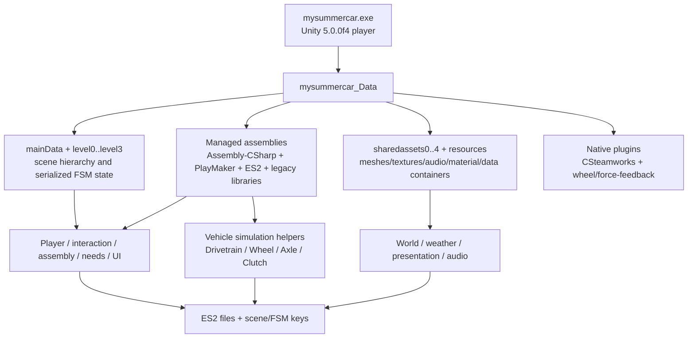

`mysummercar_Data\Unity_Assets_Files`, `Mods`, loader DLLs, and dated folders are outside the trusted source flow. They are pre-existing contamination/derived evidence and require clean-install comparison.

## Observed donor ownership map

| Area | Observed source owner | Inputs | Outputs/state | Failure/coupling observations |
|---|---|---|---|---|
| Scene/bootstrap | `mainData`, `level*`, PlayMaker FSM data | Player/menu events, scene loads | Active scene, object graph, global FSMs | Scene-name and object-name coupling is expected; level mapping unresolved |
| Player/input | Mouse-look components, `cInput`, PlayMaker input actions | Legacy input axes/buttons, camera state | Transform/rigidbody movement, look state, FSM events | Old input and scene/FSM dependencies; rewrite |
| Interaction | Serialized FSMs plus raycast/drag actions | Camera ray, rigidbody target, input | Held/placed object and events | No domain interface observed; likely name/event driven |
| Vehicle assembly | Serialized part hierarchies/FSMs | Part/tool contacts, object transforms | Installation/fastener state | No managed assembly graph identified; very high scene coupling |
| Vehicle powertrain | `Drivetrain`, `Clutch`, powered `Wheel`/`Axle` state | Throttle, clutch, gear, RPM, timestep | Torque, RPM, wheel impulse, fuel use | Useful formulas may exist inside a large Unity-coupled controller |
| Tire/suspension | `Wheel`, `CarDynamics`, `Axle`, `TireParameters` | Contact ray/state, chassis velocity, steering/brake | Forces, slip, suspension, skid state | Custom legacy physics; units/substep assumptions unknown |
| Damage | `CarDamage*`, `Repair`, collision callbacks | Collision force/contact, meshes | Deformed mesh and repair state | Presentation and persistent state are mixed |
| Fluids/electrical | `FuelTank` plus serialized FSM data | Time, assembly, engine demand | Fluid/electrical state and failures | Only fuel has a clear managed type; remainder unknown |
| Time/needs | Serialized GAME FSMs | Scheduled time, player actions | Needs thresholds/events | No reliable domain class observed; behavior capture required |
| World/traffic | Serialized scenes/assets and SWS paths | Time, route/spline state | Terrain/world objects, moving traffic | Layout data and gameplay state are likely mixed in the main scene |
| Weather | Rain/fog components plus serialized FSMs | Time/weather state, camera | Rain particles, fog, windshield effects | Rendering behavior is legacy-pipeline coupled |
| Audio | `MasterAudio`-style types and shared sound containers | Gameplay/FSM events, listener, RPM/environment | AudioSources/mixer/playlist state | Legacy routing and content provenance unknown |
| Animation | HOTween/iTween, IK components, FSM actions | FSM events and target transforms | Rig/transform presentation | Core state must not remain animation-event authoritative |
| UI | Menu scenes, `SettingsMenu`, PlayMaker GUI/input actions | Input, options/save state | Menus/HUD and settings events | Legacy resolution/input/FSM coupling; rewrite |
| Save/load | `ES2.dll`, `MoodkieSecurity.dll`, `UniqueSaveManager`, LocalLow files | Scene/FSM keys and object state | ES2/player-pref files | Schema and recovery behavior unknown; do not couple new runtime |

## Transfer boundary

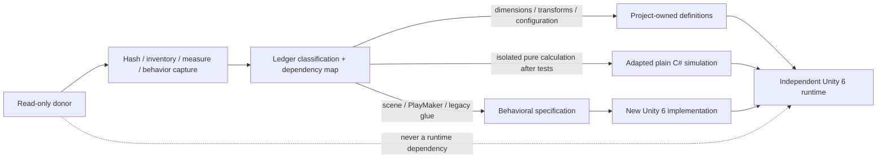

## New-runtime ownership targets

| New owner | Receives from donor | Must not receive |
|---|---|---|
| Content definitions | Verified dimensions, pivots, mount points, ratios, capacities, tables, source hashes | Donor runtime references, unverified extracted production assets |
| Plain C# simulation | Tested isolated algorithms/configuration with documented units | Giant MonoBehaviours, PlayMaker graphs, old PhysX glue |
| Runtime scene/composition | Behavioral specifications and validated layout data | Object-name lookup forests, donor scene dependencies |
| Presentation | Newly authored geometry/materials/audio/VFX aligned to measurements | Final donor textures/materials or required reference-only assets |
| Save system | Optional documented importer inputs and stable-ID mappings | Direct scene serialization or undocumented donor keys as native format |

## Concrete inspection artifacts

- File/category inventory: `E:\GAYmDev_Studio\MySummerCar_Remake_Game_DonorStaging\manifests\DONOR_FILE_INVENTORY_2026-07-13.csv`.
- Focused hashes: `E:\GAYmDev_Studio\MySummerCar_Remake_Game_DonorStaging\manifests\DONOR_RELEVANT_HASHES_2026-07-13.csv`.
- Managed file inventory: `E:\GAYmDev_Studio\MySummerCar_Remake_Game_DonorStaging\manifests\MANAGED_ASSEMBLY_INVENTORY_2026-07-13.csv`.
- Reflection-only type metadata: `E:\GAYmDev_Studio\MySummerCar_Remake_Game_LegacyReference\metadata\ASSEMBLY_CSHARP_TYPE_METADATA_2026-07-13.csv`.

## Known map gaps

- Exact `level*` to scene-name mapping.
- Serialized object/FSM hierarchy and object-to-system ownership.
- Mesh/material/animation/terrain counts and IDs.
- Vehicle part/mount/fastener graph.
- Electrical/fluid/needs/save schemas.
- Complete audio event-to-clip/mixer routing beyond the bounded Satsuma RPM/starter diagnostic mapping.
- Clean-stock comparison for the modified donor install.

## Controlled reference boundary implementation

Milestone 2 implements the metadata and validation boundary described by this map. Concrete paths, version rules, plan/execute behavior, registry/ledger ownership, build guards, and proof requirements are in `Docs/Porting/DONOR_PIPELINE.md`. The controlled proof transfers only `garage_shed_roof` and `drum_brake_rear` as `ReferenceOnly`; their independent simplified replacements are `ReauthoredGeometry`. No donor gameplay system or visual asset changed classification to `ProductionReady`.

## Milestone 3 garage world-art boundary

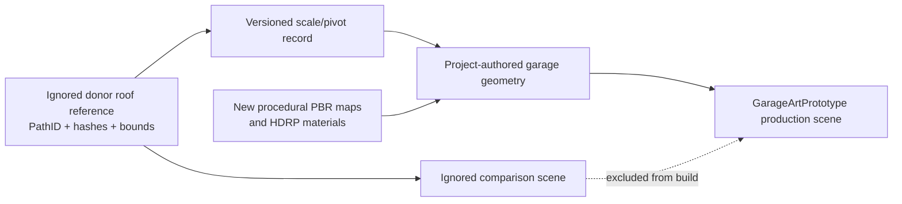

Runtime-владельцем результата является `MSC.World.Runtime`: scene marker и opt-in performance probe. Authoring, generation, metrics и validation принадлежат Editor assembly и не попадают в player. Production scene использует только rebuilt geometry/materials/textures; `ReferenceOnly` нужен лишь отдельной comparison scene.

В этом этапе donor передал только подтверждённые размеры и zero pivot крыши. Garage openings/interior, 180 m road, terrain, vegetation, lighting и atmosphere созданы заново. Это сохраняет узнаваемый масштаб без превращения donor scene hierarchy, old Unity runtime или визуальных assets в runtime dependency.

## Milestone 4 clean-room interaction boundary

Milestone 4 не использует donor gameplay data. Новый runtime flow полностью принадлежит проекту:

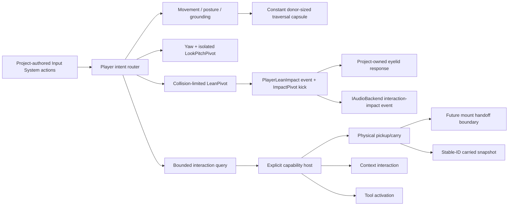

Legacy `cInput`, mouse-look components, PlayMaker actions, object-name dispatch and donor physics glue remain observational audit evidence only. They are not dependencies, ports or calibration sources for the M4 implementation.

That sentence describes the initial M4 delivery. The bounded 2026-08-10 audit
later transferred exact serialized capsule/camera values and reimplemented the
observed ground-normal behavior. BetterMSC supplied only hash-locked behavioral
evidence for the `40 degree` body arc, smooth `120 degree/s` release,
`0.11 m` collision probe and running wall impact gate. Exact donor hierarchy
evidence fixes the hinge at local `Y = -0.3 m` with a `1.7 m` standing camera
arm. Runtime feedback and audio routing remain project-owned and depend only on
Player/Audio contracts, not BetterMSC.

The 2026-08-12 secondary feel pass keeps that ownership and adds the following
project-owned presentation path:

```text
PlayerInputRouter
  -> FirstPersonMotor
       -> FirstPersonMovementMath [directional target + response + run/coyote gates]
       -> Jumped / Landed presentation events
  -> FirstPersonLook [direct yaw/pitch + presentation-only look delta]
  -> FirstPersonCameraFieldOfView [horizontal FOV + hold zoom]
  -> FirstPersonCameraMotion [MotionPivot; bounded look/body sway + timed jump preparation/launch/land; no cyclic bob]
```

Cheap Car Repair is only a hash-locked secondary
`BehavioralReference;ConfigurationTransferred` source. It is not a runtime
dependency and does not replace the locked My Summer Car donor or expand Phase
1 feature scope.

## Milestone 04A bounded world-layout flow

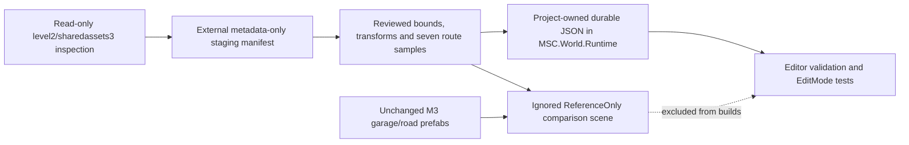

`MSC.World.Runtime` owns only serializable pilot DTOs and pure coordinate/measurement helpers. `MSC.Editor` owns local configuration access, staging hash validation, asset-dependency checks and comparison-scene generation. Production assets never depend on the ignored scene or external staging. Donor PathIDs are provenance metadata; the zone, source records and samples use project-owned stable IDs.

This map covers exactly one garage-road pilot zone. The route samples are not a complete route database or terrain centerline, and the blocked combined terrain mesh is not transferred. Player/Interaction ownership and code remain exactly as documented above.

## Milestone 04A1 full world-transfer flow

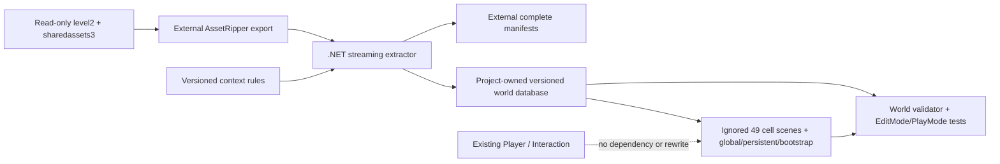

Ownership:

- `MSC.World.Runtime` — data records, coordinate conversion, partition math, landmark registry и `IWorldStreamingService` implementation;
- `MSC.Editor` — configuration, validation, cell generation, debug window и menu commands;
- external `.NET 8` tool — AssetRipper YAML normalization без Unity dependency;
- `LegacyImport/ReferenceOnly/World/Generated` — local disposable reference presentation;
- `Docs/WorldTransfer` и world database — durable audit/source of truth.

Runtime assemblies не ссылаются на Editor assemblies. Generated loader disabled в reference bootstrap, поскольку ignored cell scenes не входят в normal Build Settings; Editor overview открывает выбранные cells additively.

## Milestone 04B reference capture flow

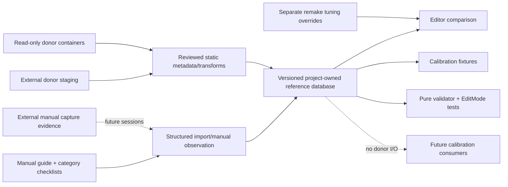

Ownership:

- `MSC.Core.Runtime` — schema, stable IDs, units, migration, querying and validation;
- `MSC.Editor` — dashboard, import/manual authoring, evidence path resolution and project validation;
- project JSON/CSV/Markdown — durable diffable truth and capture queue;
- external staging/reference storage — donor representations and future raw media;
- future vehicle/weather/audio/UI systems — consumers of validated fixtures only, not implemented in 04B.

The database can be loaded without donor assets. Machine paths remain in ignored local configuration, evidence payload stays external and runtime assemblies do not reference Editor assemblies.

Dataset `04B.4` adds only a bounded behavioral specification for the representative rear-left drum: trigger/candidate identity, Trailarm prerequisites, wheel-state removal gate, serialized `0..8` fastener stages, wrench `14`, scroll direction, three clean runtime repetitions and a user-confirmed wheel-installed blocker. It does not add a donor FSM runtime, assembly implementation or production prefab. Both M05 assembly gates are `Covered`; physical torque is intentionally not inferred from the discrete donor contract.

## Milestone 05 clean-room assembly flow

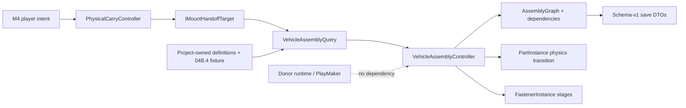

The assembly runtime uses project-owned stable/definition/mount IDs. Compatibility and blockers are data-driven; donor object names are not dispatch keys. Editor owns content generation, validation, dependency visualization and reports. The production prototype dependency graph excludes all donor/reference-only payload.

## Milestone 05A world-production flow

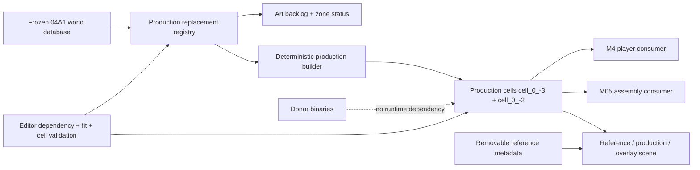

`MSC.World.Remaster.Runtime` owns serializable registry data and runtime comparison/hinge presentation. `MSC.World.Remaster.Editor` owns content generation, report generation, dashboard, capture and validation. The source database remains authoritative for identities/cells; generated scene state is never copied back into it.

Batch 01 adds `cell_0_-2 / HomeShorelinePier` as an independent streaming cell. The accepted `cell_0_-3` prefab is present only as context in Batch 01 playtest/comparison scenes; the new production-cell has no cross-cell hierarchy dependency.

## Milestone 05C1 bounded safety-topology flow

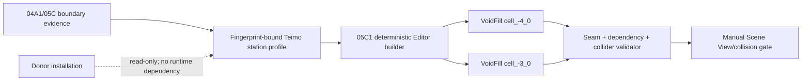

`WorldVoidFillMarker` belongs to `MSC.World.Remaster.Runtime` and carries only
project-owned region/piece/cell identity and audit metadata. Mesh generation,
reference overlay and validation stay in `MSC.Editor`; generated scenes contain
no Editor component and remain outside normal Build Settings after 05B; runtime
integration remains explicitly open as `WORLD-STREAM-005`.

## Milestone 05B validation flow

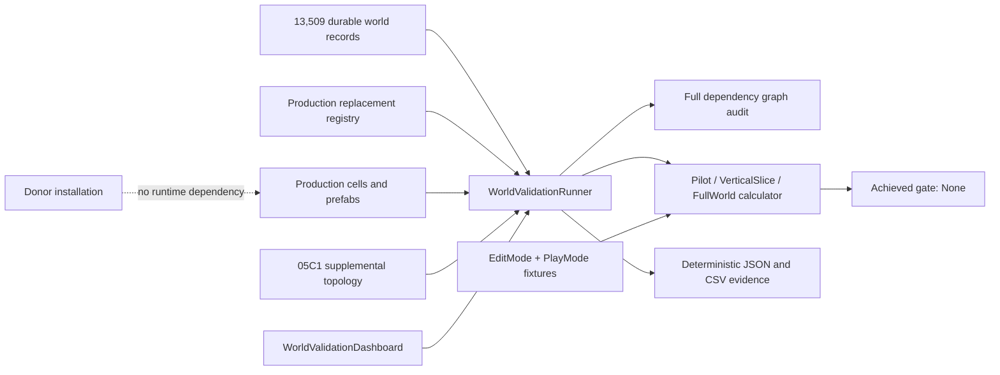

`MSC.World.Remaster.Editor` owns aggregation, dashboard and export. Runtime world,
Player and Interaction architecture remain unchanged. Direct additive lifecycle
tests exercise scene integrity, while the missing production streaming-service
boundary is kept as a blocker rather than represented by the reference loader.

## Milestone 06 clean-room simulation flow

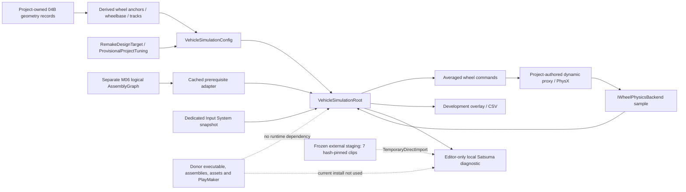

`MSC.Vehicle.Simulation` owns the model and contracts; `MSC.Vehicle.Runtime` owns Unity input, composition, PhysX, reset and presentation, including `VehicleAudioPresenter`; `MSC.Vehicle.Assembly` remains authority for part/mount/fastener state; `MSC.Audio.Runtime` owns `IVehicleAudioBackend`; `MSC.Audio.UnityFallback` owns the Editor-only `UnityAudioBackend`; `MSC.Editor` owns builders and validators.

The powertrain graph exposes generic `LeftDrivenWheel` / `RightDrivenWheel` nodes. Config indices map the single differential pair into the four-wheel array; the current authored asset selects FL/FR (`0/1`), so the prototype is presently FWD, and focused coverage verifies a `2/3` remap. AWD/multiple driven pairs remain future work. The current FWD selection is a project decision for the target vehicle; the missing donor dynamic fixture means its numeric torque, grip and response values remain provisional.

The M06 logical graph is not the dynamic proxy. Assembly state supplies availability only, while physical mass/center of mass remain provisional and uncoupled. The vehicle-owned surface markers on the bounded route do not classify production colliders and cannot close `WORLD-COL-003`.

The first manual drive confirmed the start/shift/stall/RPM loop but exposed about `5 km/h` startup creep and a shaking environment. Runtime ownership did not change: the backend now initializes suspension history without a synthetic first-sample damper impulse, uses gravity-plane speed, bounds passive correction against overshoot and performs level-only startup settling; a detached smoothed camera owns view stabilization. Focused PlayMode passes `4/4`: a six-degree slope is not pinned and a later external `WakeUp()` plus `0.05 m/s` is not re-slept. The user accepted the bounded post-remediation drive/audio recheck on 2026-07-16.

The local audio branch is diagnostic presentation only. It consumes simulation telemetry and engine state at `FixedUpdate` without becoming authoritative; PlayMode asserts `StarterEngaged -> StarterDisengaged -> EngineStarted`. Seven clips remain in frozen external staging with ledgered hashes and classification `TemporaryDirectImport`; the static `GAME.unity` RPM/starter routing evidence is `ReferenceOnly`. Nothing enters Git, production `Assets` or a build. Missing staging remains a silent fallback, the current mod-contaminated/hash-drift donor install is not used, no stop/stall parity clip is claimed, and final audio remains reauthored behind `IAudioBackend`.

Only exact reviewed geometry crosses from the reference database. Donor dynamic
fixtures are `Missing`, so every dynamic constant follows the project-authored
tuning path. The automated M06 gate passes with focused PlayMode `4/4` and full
PlayMode `31/31`; bounded manual acceptance is recorded.

## Milestone 06A validation and evidence flow

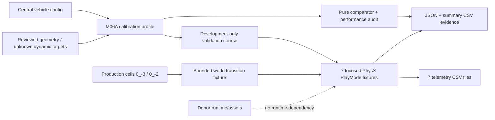

`MSC.Vehicle.Simulation` owns the validation contracts and tolerance-based
comparison model. `MSC.Vehicle.Runtime` owns the scripted rig and telemetry.
`MSC.Editor` owns the builder, strict validator, dashboard, pure performance
audit and evidence export. The validation scene stays outside production Build
Settings.

Builder/validator, focused EditMode `7/7` and focused PlayMode `8/8` pass.
The bounded production run reaches `z=-1024` after `12.255066 m` with four
contacts, and the next-cell-only probe at `z=-970` also retains four contacts.
This is technical collision/streaming evidence only: both pilot cells remain
`Rejected` / `NeedsRework` for donor visual and spatial parity.

The pure managed audit reports `2.571855 / 3.55201 / 5.962805 us/tick` at
`1/2/4` substeps, telemetry `6.04886 us/tick`, scripted validation
`6.95269 us/tick` and zero measured allocations. Production telemetry after a
50-frame warmup reports mean root + backend `0.038197 ms`, linear p95 `0.0461 ms` and
maximum `0.0629 ms`. Schema-v4 PhysX evidence also records blocking
`Physics.Simulate` means `0.024990 / 0.023025 ms`, combined means
`0.038737 / 0.036251 ms` and zero allocations with telemetry consumer off/on.
The `Physics.Processing` marker, GPU timing and player 60 FPS acceptance remain
unavailable.

M06A is `Accepted / HumanAccepted` as a bounded prototype baseline on
2026-07-16. Only `Prompts/06B_PRODUCTION_WORLD_CELL_FIDELITY_GATE.md` may
follow.

## Milestone 06B1 donor-world sanitation boundary

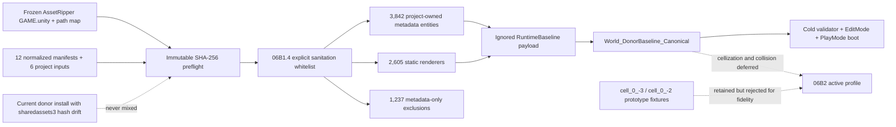

`MSC.Editor.WorldBaseline` owns preflight, sanitation, generation, source
manifest, fingerprints, captures and validation.
`MSC.LegacyImport.Runtime` owns only project-authored metadata components.
Generated donor-derived scene/mesh/material payload stays below the ignored
`Assets/Game/LegacyImport/RuntimeBaseline/` boundary and is classified
`TemporaryDirectImport`.

No gameplay module consumes donor hierarchy paths. The canonical baseline is
not in Build Settings and is not an active world profile in 06B1. The existing
project-owned 512 m cell grid, additive loading, exact scene-path checks,
hysteresis and owned-scene unload remain the reusable streaming authority.
06B2 must add the explicit legacy/global/cell profile, collision/traversal
validation and prototype-visual deactivation without changing stable gameplay
identity.

## Milestone 06B2 active streaming and ownership flow

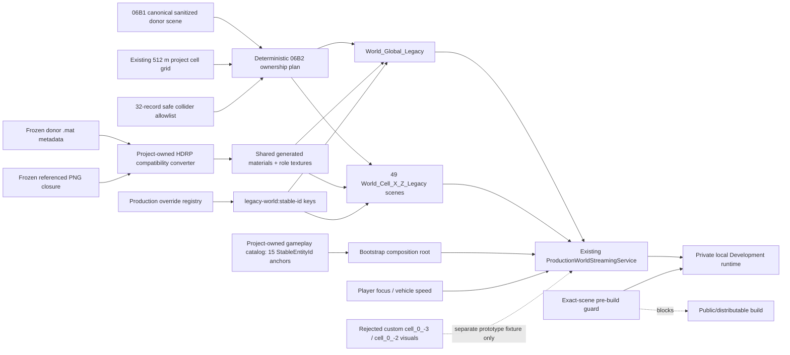

`MSC.Editor.WorldBaseline` owns deterministic planning, generation, inspection,
validation and build guarding. `MSC.LegacyImport.Runtime` owns only
project-authored metadata/replacement contracts. `MSC.World.Streaming` remains
the runtime scene lifecycle authority. `MSC.Bootstrap` waits for required
global/focus scenes before player activation and installs project-owned
out-of-bounds recovery.

The runtime distinguishes scene ownership by scene handle and reconciles
external unload/reload, preventing an externally reloaded scene from being
unloaded by stale streaming ownership. Global legacy content remains loaded
while focus cells change. A speed at or above `12 m/s` expands preload from
radius `1` to radius `2`; unloading uses radius `2`.

Gameplay identity does not live in generated donor scenes. The separate catalog
survives visual replacement, and each legacy presentation record can be disabled
through its stable replacement key. Donor hierarchy paths remain provenance
metadata only.

The active donor profile replaces the two rejected custom visual cells without
deleting their technical fixtures. Automated lifecycle/collision validation
passes. The user accepted Bootstrap startup, donor-map fidelity, walking to the
lake, Teimo-area unload/reload and out-of-bounds recovery on 2026-07-16.
The flat lake and original-game terrain voids remain late-remaster debt.

The v5.1 presentation path keeps donor shader/runtime systems outside the new
runtime. `MSC.Editor.WorldBaseline` reads frozen material metadata and referenced
images, generates shared HDRP Lit/Unlit compatibility assets below the ignored
RuntimeBaseline boundary and records source hashes in committed manifests.
`MSC.LegacyImport.Runtime` switches `LegacyTextured` and `LegacyDiagnostic`
through `Renderer.sharedMaterials`; it does not create material instances or
become gameplay authority. The earlier bounded geometry/traversal evidence and
the v5.1 representative-area textured review, including corrected water, are
human-accepted as of 2026-07-16. Legacy material, terrain-banding and tree-wall
artifacts remain accepted temporary debt. On 2026-07-16 the user walked the
bridges and moved the character across cell boundaries without observed
traversal, collision, seam, duplicate, popping or load/unload issues. The
bridge/cell-boundary gate is `PASS / HumanAccepted`; dedicated vehicle driving
was not repeated, while automated high-speed preload validation passed. The
later 06B3 validation/freeze closed as `PASS / Frozen / HumanAccepted`. This
leaves the donor baseline temporary and does not change its transfer
classification.

## Milestones 07A/07B project-owned environment flow

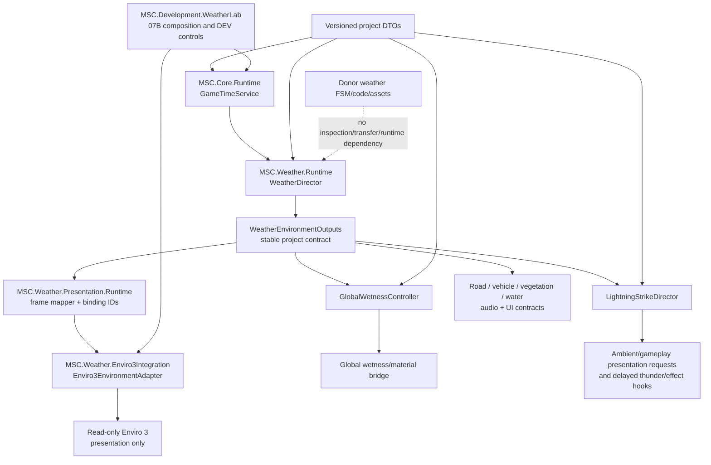

Ownership and boundaries:

- `MSC.Core.Runtime` owns deterministic game date/time, pause/scale, scheduling,
  snapshots and time DTOs. Mutation callbacks are ordered and transactional:
  failures restore clock/due-queue state, while reentrant mutation fails closed
  without poisoning the next operation.
- `MSC.Weather.Runtime` owns seeded fronts/timeline, overrides, stable outputs,
  wetness, shelter/exposure, lightning selection/fairness and weather DTOs.
- `MSC.Weather.Presentation.Runtime` owns vendor-neutral binding IDs, frames,
  validation and shared wetness shader output.
- `MSC.Weather.Enviro3Integration` is the only runtime assembly that references
  Enviro. It pushes project time/weather into runtime-isolated presentation
  objects; vendor assets and runtime objects are never game-state authority or
  serialized save identity.
- `MSC.Development.WeatherLab` and its Editor assembly own the bounded 07B
  composition, DEV window, builder and diagnostics. Composite DEV advance also
  rolls back time/weather/wetness/lightning when a scheduled callback fails.
  Production world cells are unchanged until 07C.

Every logical value introduced in 07B is project-authored
`RemakeDesignTarget`; no donor time/weather algorithm, transition duration,
wetness value or lightning rule is claimed as `CodePorted` or
`ConfigurationTransferred`. The porting ledger records these as explicit
`ProjectAuthored/Milestone07B` implementation rows with no donor source hash.

Automated closure evidence is vendor-neutral core `101/101 PASS` (`20` GameTime,
`29` WeatherDomain, `52` WeatherPresentation), Enviro integration `13/13 PASS`,
WeatherLab time-domain integration `3/3 PASS`, and performance harness `1/1
PASS`. Builder/fresh preflight `Logs/M07B_WeatherLabBuilder_Final_03.log` is
`PASS`. The automated Editor PlayMode JSON is
`PerformanceCaptures/Milestone07B/M07B_WeatherLab_Performance.json`; manual
captures and standalone/real-GPU performance sign-off remain `PENDING`. The
accepted read-only vendor baseline is `538` files / `305967931` bytes /
`8e376fa2748162157975fbdd8b1045e021b810fea40f01d99eafe22a4d30bd44`.
The architecture map does not promote automated Editor timing to manual or
standalone-player acceptance.

Milestone 07A is fixed in commit `61250e2`; Milestone 07B handed its project-owned
domains into `07C_PRODUCTION_WEATHER_ROLLOUT_AND_VALIDATION.md`. The current 07C
topology and night/dawn follow-up are recorded below. The manual dawn/night
retest is user-accepted; performance and other scoped gates remain pending.

## Milestone 07C production environment topology

```text
GameCompositionRoot (persistent session owner)
  -> ProductionEnvironmentController
       -> GameTimeService / WeatherDirector
       -> GlobalWetnessController / LightningStrikeDirector
       -> versioned project save DTO and cross-system outputs
       -> IEnvironmentPresentationAdapter
            -> Enviro3EnvironmentAdapter (only Enviro-aware runtime boundary)
                 -> solar calibration 60 N / 27.3 E / UTC+3
                 -> same-pass sun update; aurora suppressed
                 -> smooth minimum night exposure 7.5 EV
                 -> temporary baseline reflection intensity <= 0.6
  -> ProductionEnvironmentBackendActivator
       -> inactive authored ProductionEnvironmentBackendMarker
            -> linked Enviro source prefab + runtime-isolated HDRP volume profile
            -> Enviro3ShelterRemovalBridge
            -> two project-owned home Interior AABBs
                 -> tiled removal zones with vertical stretch >= 1
            -> DonorWorldLegacyWetnessBridge
                 -> wet smoothness <= 0.45 opaque / 0.25 alpha-clip
  -> ProductionWorldStreamingService
       -> additive donor-baseline cells (never weather owners)
```

The composition root wins process/session ownership before the inactive Enviro
backend is activated. On a same-scene Single reload, the replacement waits for
the previous persistent root and Enviro static manager to be destroyed before
enabling its linked prefab. The streaming installer waits for backend readiness
before coherent restore/presentation sync and world reveal. Additive scene
callbacks are coalesced and revalidated after Unity finishes deferred
destruction/vendor startup; a real duplicate manager or WindZone fails closed.

`ProductionEnvironmentController` survives cell changes, rebuilds shelter
registrations from the explicit persistent root plus loaded scenes, and is the
only authority for time/weather/wetness/lightning. Enviro autonomous time,
schedule, gameplay lightning and audio remain disabled. Audio, UI, vehicle,
water and vegetation consume vendor-neutral project outputs only.

The committed Enviro hierarchy remains a linked prefab because it is authored
inactive; this avoids the vendor Editor `OnEnable` unpack hook without changing
vendor source. The package boundary is unchanged at `538 / 305967931 /
8e376fa2748162157975fbdd8b1045e021b810fea40f01d99eafe22a4d30bd44`.
The follow-up solar calibration produces approximate `04:59` and `21:35`
horizon crossings on the reference date. Its `7.5 EV` minimum night exposure
blends from full-night `solarTime <= 0.43` toward unchanged daylight at `0.5`.
Fresh automated results are Enviro integration `17/17`, combined production
EditMode `32/32` and lifecycle PlayMode `6/6` in
`Logs/M07C_VisualRemediation3_*`. Full EditMode is `328/334`: the same four
historical failures plus two current WorldBaseline material-contract failures
from four ignored generated materials already rewritten before this follow-up.
A fresh focused WorldBaseline rerun is `8/10` with the same two failures, so the
current generated-payload drift is persistent rather than test-order pollution.
The previous `Logs/M07C_VisualRemediation2_WorldFreeze.log` remains the last
strict frozen-world `PASS`, with result SHA-256
`10544fc3ed5bd6c8cd44b451155e766c0552710f4c9d8cc91dda263de001ba5f`;
current generated-material validation is not clean. The user accepted rain and
the current sunset, accepted metallic-looking surfaces as temporary donor
material/shader debt, and marked the corrected dawn/night presentation
`USER PASS` on 2026-07-18 without capture artifacts. Matched fidelity, other
interiors and performance evidence remain pending; the whole 07C milestone is
not marked passed.

## Milestone 08 audio ownership map

```text
Vehicle telemetry ----> VehicleAudioPresenter ----> IVehicleAudioBackend
Weather outputs ------> WeatherAudioPresenter -----+
Interaction completed -> InteractionAudioBridge ---+-> IAudioBackend
Player displacement --> PlayerFootstepAudioPresenter +
Listener/zones/portal -> AudioListenerContext ------+
Weather exposure -----> listener fallback ----------+
                                                     -> AudioBackendRouter
                                                          -> WwiseAudioBackend
                                                             (official API only)
                                                          -> UnityAudioBackend
                                                             (fallback)
```

`MSC.Audio.Runtime` owns stable IDs, maps, handles, emitter/listener contexts,
settings, validation and router lifetime. Domain assemblies do not reference
Wwise or Enviro. `MSC.Audio.Wwise` is the only project adapter that references
the official Wwise integration; `MSC.Audio.UnityFallback` remains operational
when Wwise is unavailable. Scene unload removes scene-owned emitters/voices.

Production Enviro audio remains disabled. Project weather outputs are the sole
rain/wind/thunder source. Donor gameplay clips are local ignored
`TemporaryDirectImport` prototypes only; final audio is newly authored. The
production composition now owns the complete reviewed `MAP/SoundAmbience`
phase roster: spatial morning/day/evening/night/swamp/meadow layers, distant
dog, three lake emitters and the deliberately rare fair-weather chainsaw near
the player home. Wind chime and insect clips are mapped as local gameplay hooks,
not unconditional ambience. Expanded mechanical/interaction producers and UI
sounds remain `DeferredHook`, not active runtime coverage. Player footsteps are an active typed producer with grounded
distance cadence, teleport reset and explicit surface metadata. Explicit audio
zones override the coarser production weather-exposure listener fallback.

Wwise authoring validates 65 events, 32 RTPCs, 4 switch groups, 3 state groups,
5 user banks plus `Init`, 6 mixer buses/Volume curves, 7 routed roots and exact
child routing `65/65`. Footsteps validate 10 sounds, 5 random pairs and `9/9`
assignments. Live Bootstrap functional PlayMode is 7/7 with six banks and no
missing bank; the user also confirms Wwise/6/0 in the runtime diagnostics.
Post-remediation performance 1/1 records baseline/peak/cleanup emitters/voices
2/0 -> 3/5 -> 2/0, `0 B`
allocations in bounded RTPC/vehicle/weather updates and zero occlusion queries.
The private Windows Development build is `844,040,197 B`; its complete folder is
`844,257,747 B`, all six packaged banks hash-match, and native boot initializes
Wwise SDK `2025.1.9.9197`.
Headless output suspension leaves audibility and real-device Wwise Profiler CPU
manual. The user accepted the bounded Milestone 08 baseline on 2026-07-18 and
explicitly deferred more detailed zone/mix tuning to polishing. Full EditMode
is 350/356 with six unrelated Garage/World failures. Full
PlayMode is 68/70 with one unrelated VehiclePhysicsValidation GarageExit failure
and one environment-gated performance skip; the explicitly enabled performance
run is 1/1, and the exact failed vehicle-route case is 1/1 in an 8.696 s
isolated rerun. The full-suite failure is order-dependent/flaky and outside
audio; neither full suite is claimed as a pass.

## Milestone 09B item and persistence ownership map

```text
ProductionWorldStreamingInstaller (persistent Bootstrap composition)
  -> ItemWorldRuntime
       -> Phase1ItemDefinitionCatalog (86 definitions)
            -> 79 required roster definitions
            -> 3 optional candidates with unproven donor reachability
            -> 4 project-owned spawned child definitions
       -> Phase1ItemPlacementCatalog (43 canonical top-level placements)
       -> WorldItemInstance
            -> project-owned DefinitionId + StableEntityId
            -> mutable content/open/broken/enabled/variant/liquid/container state
            -> PhysicsPickupTarget / existing carry-place-throw boundary
            -> held-item and held-tool capability boundaries
            -> ItemActionCompleted status hook
       -> centralized critical-item out-of-bounds recovery
       -> ItemPresentationProvider
            -> 46 reviewed TemporaryDirectImport wrappers / 90 meshes
            -> project-owned proxy fallback for definitions without a wrapper

NativeSaveSessionController
  -> ItemSaveParticipant [items.instances.native.v1, restore phase 150]
       -> logical item state and contained StableEntityIds
       -> DeferredStableEntityStore for unloaded cells
       -> migration from older native saves by adding an empty v1 item domain
  -> WorldEntitySaveParticipant [restore phase 200]
       -> Rigidbody pose/velocity for the same StableEntityId
```

`MSC.Items.Runtime` owns immutable definitions, mutable item instances,
deterministic child identities, canonical/dynamic materialization, generic use
state and centralized recovery. `MSC.Items.Editor` owns the deterministic roster
and placement builders plus the sanitized presentation plan/build validator.
`MSC.Save.Integration` owns the `items.instances` participant; it does not make
presentation assets authoritative. Physical pose remains in the established
`world.entities` domain, so item logical state is restored before pose.

The donor hierarchy is evidence only. Runtime lookup is by project-owned
catalogs, stable IDs and explicit capabilities. Generated donor presentation is
private, ignored and replaceable through stable replacement keys; it contains no
donor scripts, FSMs, physics or gameplay authority.

This is a **PartiallyImplemented** boundary, not 09B parity closure. Catalog build
and presentation plan/build completed with exit code `0`; the presentation
report records `46` bindings, `90` synchronized meshes and `17` fallback
material slots. At this documentation audit there is no executed row-by-row
donor comparison, production save/load + stream-away/back route, complete item
UI/audio feedback, or proof for every donor-specific transition. Exact
milk/beer/booze/cigarette effects, kilju action order, disposable variants,
spray colors and screwdriver/ratchet roster coverage remain explicit gaps. The
optional trophy/eyewear/hat candidates remain `Blocked` by unproven locked-donor
reachability; no 09B row is marked `Verified`.

## Milestone 09C time, lighting and HUD follow-up map

```text
GameTimeService
  -> 7,200 real seconds per game day at scale 1
  -> ProductionEnvironmentController
       -> Enviro3EnvironmentAdapter
            -> bounded sun/moon target update
            -> 0.3 s presentation interpolation between targets
  -> WorldLightingProbeRuntime
       -> night/day streetlight activation

ProductionWorldStreamingService
  -> OwnedSceneLoaded / OwnedSceneWillUnload
       -> WorldLightingProbeRuntime
            -> Phase1WorldLightingProbeCatalog
            -> 39 project-owned point lights
            -> 6 queued realtime reflection probes

GameUiRoot
  -> needs HUD: top-left
  -> time + money HUD: top-right
  -> FPS HUD: bottom-right
       -> unscaled 240-frame sample queue, 4 Hz text refresh
       -> UiSettingsDocument v3 ShowFpsCounter
            -> schema 1/2 migration defaults to enabled
```

The donor `SUN/Clock` FSM supplies configuration evidence only:
`MinutesAdd=0.2` and `TimeScale=300`. No PlayMaker state or donor time code is
executed. The composite time config remains `RemakeDesignTarget` because
sunrise/sunset policy remains project-owned.

### 09C continuous-use and Phase 1 viewmodel boundary

```text
PlayerInputRouter [F press / hold / release]
  -> PlayerInteractionController
       -> empty hand + explicit IContinuousActivationPickupTarget
            -> PhysicalCarryController preflight
            -> real IPickupTarget pickup
            -> IContinuousHeldActivationTarget begin
       -> held bottle
            -> IContinuousHeldActivationTarget continue/end
                 -> WorldItemInstance content + proportional need effects
                  -> ItemWorldRuntime held-use presentation event
                       -> FirstPersonLifeActionPresenter
                            -> mandatory private Phase 1 viewmodel binding
                            -> project-owned physical bottle pose

PlayerInputRouter [H / M or gamepad D-pad Up / Right]
  -> project-owned WaveRequested / MiddleFingerRequested events
       -> FirstPersonLifeActionPresenter gesture admission
            -> interruptible viewmodel-only animation
            -> no simulation or save authority

Phase1PlayerViewmodelImporter [Editor only]
  -> authoritative JSON manifest
  -> locked AssetRipper export + SHA-256/GUID validation
  -> donor hand transforms/timings retained as read-only behavioural evidence
  -> user-licensed AXIS Neutral Arms package
       -> exact source SHA-256 validation + deterministic Blender export
       -> side-indexed right/left arm meshes with full-rig morphs excluded
       -> project-authored HDRP material and 14 bone-only clips covering
          drink, smoke, wave, middle finger, push and thumbs-up
  -> ignored RuntimeBaseline Resources prefab
       -> FirstPersonLifeActionViewmodelBinding
             -> direct AnimationClip sampling (Unity 6 Generic workaround)
             -> presentation only; no input, simulation or save authority
  -> manifest-linked ignored build report
       -> Phase1PlayerViewmodelBuildGuard [fail closed before player build]
```

The donor animation curve duration remains evidence for the provisional Phase
1 drink rate, but the simulation advances from elapsed unscaled time and is not
driven by animation frames or events. The generated prefab excludes donor and
vendor code, FSMs, controllers, shaders and prop meshes. The real project-owned
bottle is snapped to the licensed right-palm grip only for presentation. Its
replacement key is
`presentation.player.viewmodel.phase2`, so Phase 2 can swap presentation without
migrating item state or saves. Primitive arms are retained only as a noisy
Editor/development fallback; a player build cannot pass while the required
private payload is absent, incomplete or stale against its manifest.

The lighting generator reads fixture transforms from Editor-only metadata and
writes stable project IDs plus cell ownership into a committed catalog. Runtime
never searches donor hierarchy paths. Enviro remains the only sky/sun/weather
owner; local lights and probes are cell-owned presentation consumers.

The HUD relocation and optional counter are explicit user-approved exceptions
to the accepted 08A layout. They do not redesign the menu/settings shell or move
simulation authority into UI.

## Mesh vegetation authoring and runtime map

```text
ProductionWorldStreamingManifest
  -> VegetationCellCatalog
       -> VegetationCellAsset [one per existing streaming cell]
            -> world-XZ RGBA PNG density mask
            -> 32 m vegetation tiles
                 -> deterministic compact instance records

VegetationPainterTool [Editor only]
  -> VegetationSurface / VegetationBlocker
  -> nearest relevant mesh hit and bridge/road clearance policy
  -> partial mask-rectangle updates
  -> stroke-scoped Undo/Redo
  -> dirty-tile rebuild on MouseUp

VegetationWorldRenderer
  -> per tile/profile structured GPU buffer
  -> tight bounds, camera/frustum/distance culling
  -> near/middle/far dithered LOD
  -> Graphics.RenderMeshIndirect
```

`MSC.World.Vegetation` is a project-owned presentation/authoring layer. It does
not change stable world coordinates, existing scenes, streaming APIs, roads,
bridges, buildings or donor-baseline geometry. Surface and blocker assignment is
an explicit authoring action; the system never infers gameplay authority from
donor hierarchy names.

## Teimo bicycle route and presentation

```text
Phase1TeimoBicycleRouteManifest [Editor evidence]
  -> Milestone10ANpcFoundationBuilder
       -> M04A1 source-to-project translation
            -> donor world point + (169.98, 1.611, -1040.625)
            -> real cell_-2_0 / cell_-3_0 ownership validation
       -> 74 stable bicycle-route anchors
       -> route.teimo.bicycle-to-store / route.teimo.bicycle-to-home
       -> project-owned arc-length Catmull-Rom traversal + analytic tangent
       -> schedule blocks with presentation binding override
       -> 17 timed teimo_move_in root anchors
       -> route.teimo.shop-arrival / schedule.teimo.shop-wait

GameTimeService
  -> NpcSimulation [authoritative schedule/route/progress]
       -> NpcPose [cell + ground-conformance request]
            -> NpcWorldRuntime
                 -> CharacterPresentationCatalog
                      -> ordinary Teimo wrapper at service blocks
                      -> bicycle wrapper during route blocks
                      -> procedural rider-leg targets from the rotating crank
                 -> TeimoShopWorldPresentationController
                      -> parked bicycle visibility by stable world IDs
                      -> service-door pivot/OPEN/CLOSE by stable world ID

npc.state
  -> active block + route + progress
  -> restore before presentation reconciliation
```

The presentation switch does not create a second logical NPC and adds no save
schema. Source spline points never enter runtime in donor coordinates: the
builder applies the same audited garage-anchor rebase as the world baseline and
requires each resulting owner to exist in the production streaming manifest.
Streaming can remove/recreate either wrapper while the same Teimo instance
continues off-screen. Collision/ragdoll state is not yet part of this map;
future Phase 1 work must add the donor result without making presentation or
animation callbacks authoritative. Phase 2 may extend that state with
remount/walk recovery after the gate.

## Base-map mesh to Terrain migration

```text
World_Global_Legacy + 50 legacy cells [read-only canonical baseline]
  -> MapMeshScanner [donor provenance filter]
       -> MapMeshInventory JSON/CSV
       -> BlenderMapExporter 1.2
            -> OBJ/MTL + textures/material metadata + world matrices
       -> TerrainSurfaceSampler [world-space barycentric heights]
            -> TerrainHeightSmoother [global bounded grid]
            -> RoadConstraintBuilder [road bed only; elevated structure excluded]
            -> TerrainGridBuilder
                 -> 72 TerrainData/TerrainLayer assets
                 -> five residual-ground mesh assets
                 -> MapMigrationTerrainNeighborConnector
                 -> 3Buildings_TerrainMigration.unity [separate output]
       -> MapMigrationValidator
            -> source hash/instance/preservation checks
            -> seams, road clearance, bridge burial, missing scripts
            -> JSON/Markdown + source/generated/difference PNGs
```

The generated scene preserves the canonical hierarchy as a copied scene-layer
baseline and disables only the seven classified ground renderers there. Roads,
buildings, bridges, water, vegetation, props and collision retain their source
transforms and references. Runtime marker components contain only migration
metadata/neighbor repair; they do not become gameplay authority or introduce
name-based architecture.

## Milestone 11B-R1 story-traffic route boundary

```text
locked GAME.unity [Editor-only, hash checked]
  -> Phase1TrafficRouteEvidence
       -> exact Highway / Bus / Dirt / local / boat / train route records
            -> Milestone10ANpcFoundationBuilder
                 -> existing Jani/Petteri route IDs on Highway anchors
                      -> NpcSimulation [schedule + route progress + save]
                            -> StoryTrafficVehiclePresentationBinding
                                 -> smoothed Rigidbody pose
                                 -> queued route samples while blocked
                                 -> obstacle braking + collision event
                                 -> single importer-owned wheel correction
                                 -> road/terrain height + normal sampling
                                 -> wheel presentation
                            -> StoryTrafficVehicleAudioPresenter
                                 -> IAudioBackend
                                 -> gear/RPM/load parameters
                                 -> no starter event from streaming lifecycle
```

The locked routes are configuration evidence, not donor runtime code. The
existing NPC state remains authoritative for the two story drivers; later 11B
actors require a dedicated `traffic.state` domain rather than overloading NPC
presentation state.

R2A adds a physical-residency exception for materialized story cars: the NPC
logical route remains the off-screen/save authority, but presentation removal
checks the loaded cell containing the actual vehicle transform. The road driver
uses cruise, brake, pass-out, pass, return and reverse states; the locked route
is a guide and no donor FSM becomes runtime authority.

## Milestone 11B-R2B incident/audio extension

```text
NpcSimulation [route/save authority]
  -> NpcWorldRuntime [persistent per-car runtime owner]
       -> exact 61904 Perajarvi formation anchors
            -> once-only reverse Village -> RoadRace departure
            -> seamless Highway 464 loop handoff
       -> StoryTrafficVehiclePresentationBinding [streamed wrapper]
            -> brake/pass/return/reverse planning
            -> actual-contact 5 m/s crash boundary
            -> bounded drift + last-safe-pose recovery
            -> captured transient state on wrapper removal
       -> StoryTrafficVehicleAudioPresenter [not streamed]
            -> logical or physical 3D emitter pose
            -> persistent engine/music/skid handles
            -> emitter-scoped RPM/load/slip RTPCs
            -> IAudioBackend stable events
                 -> Unity fallback supplemental library now
                 -> Wwise event/bank authoring later
```

Short-lived incident/recovery state survives ordinary cell streaming during
the active session but is intentionally not durable donor save state. Driver
route/progress and Suski's rescue flag remain authoritative in `npc.state`.

### 11B-R3 exact-route and durable-incident supersession

The R1/R2 Highway composition and transient-only incident paragraph above are
historical. The active graph is:

```text
locked Navigation evidence [Editor-only]
  -> exact linear driver race routes
       -> TrackField 228..290
       -> Village 0..294
       -> RoadRace 0..623
       -> TrackField 0..201 + 7 x 73..201
  -> separate Dancehall out/reverse routes
        -> NpcSimulation [schedule, progress and save state]
            -> NpcWorldRuntime [scenario + incident authority]
                 -> StoryTrafficVehiclePresentationBinding
                      -> NWH wheel/contact backend
                      -> permanent physical residency for Jani/Petteri
                      -> Teimo handbrake look-ahead 7..10 m
                      -> ~245 m anticipatory RoadRace-exit brake cap
                      -> terminal full-brake hold at >=5 m/s crash
                 -> Suski rescue stages
                      -> PhysicalCarryController
                      -> anchor.story.suski-rescue-bed
                      -> PlayerNeedsRuntime successful sleep

npc.state [v13, required]
  -> authored schedule, route progress, character flags

traffic.state [schema 1, optional additive]
  -> driver stable IDs, crash telemetry and wreck poses
  -> Suski stable ID, intermediate rescue stage and pose
  -> restores after core.time and npc.state
```

Loaded physical driving remains Rigidbody-authoritative. The optional traffic
domain makes terminal consequences durable without widening the accepted NPC
DTO or requiring a document-version migration. Old v13 saves without the
domain use fresh traffic state. The temporary race-start trigger is not donor
parity and is replaced when Satsuma exposes its stable rev challenge event.

### 11B-T1 general traffic graph

```text
locked GAME.unity [Editor-only, SHA-256 checked]
  -> Phase1TrafficRouteEvidence
       -> 8 exact route records / 7,715 points / 20 directional joins
            -> TrafficRoadNetworkCatalog [project asset]
                 -> TrafficWorldRuntime [logical authority]
                      -> 10 stable Highway actor states
                      -> selected-root real-time logical advancement
                           -> no game-clock catch-up / no offscreen collision
                      -> retained-first 440 m materialize / 520 m remove
                           -> max 6 ordinary physical wrappers
                      -> Pena + Saturday context outside ordinary cap
                           -> TrafficPresentationCatalog
                                -> 7 replaceable wrappers
                                     -> Rigidbody + NWH wheel contact
                                     -> project-owned motion/control backend

traffic.state [schema 1, optional additive]
  -> story incidents and Suski rescue state
  -> ambient actor spawn/progress/circuit/attempt state
```

The logical runtime never searches donor object names or hierarchy paths.
Donor names and transform IDs exist only in Editor evidence/import code and
provenance. Physical wrappers are residency views; destroying one does not
destroy or duplicate the actor identity. Ordinary actors use logical offscreen
progress, but Jani, Petteri, the bus and Pena are explicit permanent-physics
exceptions selected to preserve race/crash/story outcomes. This is a
project-owned policy; offscreen ordinary contacts are not simulated.

### 11B-T2 public transport extension

```text
locked GAME.unity [Editor-only, SHA-256 checked]
  -> Phase1TrafficRouteEvidence
       -> BusRoute / stops / two-hour departures
       -> Train east-west endpoints / speed / endpoint wait
       -> AIboat1 + AIboat2 waypoint loops
            -> TrafficRoadNetworkCatalog [4 stable transport definitions]
                 -> TrafficWorldRuntime.Transport [logical/save authority]
                      -> train/boat offscreen route/dwell progression
                      -> BUS permanent physical route progression
                           -> 60..82.5 km/h, zero wander/drift
                      -> remaining class-specific residency hysteresis
                           -> TrafficTransportPresentationBinding
                                -> BUS: NWH physical road presenter
                                -> TRAIN: kinematic route presenter + collider
                                -> BOATS: Rigidbody force/turn/water-height presenter
                      -> TrafficBusPassengerInteractionTarget
                           -> explicit passenger seat/exit anchors

traffic.state [schema 1, optional additive]
  -> transportActors [departure/route/dwell/direction/pose]
```

The interaction, simulation and save state are project-owned. The four wrapper
prefabs are replaceable views and contain no donor script/FSM/controller. An
old save without `transportActors` receives fresh transport state; no schema or
stable-ID migration is required.

## 12A-E1 economy foundation

```text
locked GAME.unity + PlayMakerGlobals.asset [Editor-only, SHA-256 checked]
  -> Phase1EconomyEvidence
       -> 3000.00 MK fresh balance
       -> 38 Teimo base prices
       -> 5.4% additive Thursday price cycle
            -> EconomyPriceCatalog [immutable project data]
                 -> EconomyRuntime [authoritative wallet + ledger]
                      -> atomic/idempotent transactions
                      -> insufficient-funds and refund validation
                      -> IPlayerMoneyService -> accepted 08A HUD

core.time [save dependency]
  -> economy.player [required schema 1]
       -> balance + price cycles + ordered ledger
       -> save document migration 13 -> 14
```

No gameplay code reads donor variable names or hierarchy paths. Those names
exist only in the Editor evidence reader and catalog provenance.

## Hybrid Enviro / native HDRP environment boundary

```text
ProductionEnvironmentController [authoritative accepted domain]
  -> time + calendar + deterministic weather + wetness + lightning + save
  -> ProductionWeatherStateSource [normalized, read-only]
       -> Enviro3EnvironmentAdapter
            -> sky + clouds + sun/moon visual + precipitation presentation
       -> NativeHdrpWeatherBridge [only native HDRP writer]
            -> Fog + Exposure + indirect light + light volumetric dimmers
       -> WeatherExposureResolver
            <- explicit WeatherZone + WeatherPortal registrations
            <- WeatherZoneStreamingBinder
                 <- WeatherZoneCellCatalog [project stable IDs + scene paths]
                 -> 20 streamed closed-interior/shelter definitions
                    live and die with their additive legacy cells
            <- TeimoShopWorldPresentationController
                 -> existing service-door transform-angle portal only
            -> local Enviro effect removal
            -> independent Wwise weather RTPCs through IAudioBackend
```

The active global volume responsibilities are split into an Enviro sky-only
profile and a project-owned native HDRP profile. Closed rooms use local
volumetric-fog `Min` blend volumes instead of disabling exterior fog. Donor
interior paths are authoring evidence only; runtime zones use project-owned IDs,
colliders and adapters. The binder never edits or queries donor scene hierarchy;
the remaining Teimo/Fleetari openings stay closed until their project-owned
door/window state providers exist. KWS/water ownership is unchanged.

Migration v8 adds two bounded presentation contracts without changing domain
authority. `NativeHdrpWeatherBridge` evaluates project time into a smooth Fixed
Exposure curve: `7.25 EV` at 23:00-03:00, a 03:00-07:00 dawn ramp, `12.5 EV`
at 07:00-19:30, and a 19:30-23:00 dusk ramp. Weather compensation and the
existing ambient-darkness offset are applied afterward inside `-1..14 EV`.
This is independent of camera luminance and cannot change when the player only
changes view direction.

The Enviro rain clone retains authored per-weather intensity and requested
sixfold density scaling, but saturates at `8,000 particles/s` and `8,000` live
drops. Collision splashes are sampled at `20%`, capped at `512`, and use Low
quality static collision against only `Default`, `WorldSurface` and
`WorldSolid`, with `128` collision shapes. Vendor assets and presets remain
read-only. A representative real-GPU storm capture is still required before an
exact FPS result can be accepted.

## 12A-S1 physical commerce and Teimo presentation

```text
Phase1ServiceCatalog + exact donor-evidenced coordinates
  -> ProductionServiceInteractionInstaller
       -> 60 logical store shelf offers / 62 physical interaction groups
            -> exact reviewed donor/mod interaction collider per group
            -> ServiceRuntime remaining stock -> visible unit count
            -> basket -> register checkout
            -> 41 locked donor-backed groups
            -> 19 outside-milestone Expanded Shop offers / 21 physical groups
                 -> hash-locked third-party configuration + presentation evidence
                 -> exact group, Col and ordered Inventory transforms
                 -> 20 sanitized shelf-group prefabs + collider-only sausage group
                 -> duplicate mustard/ketchup groups share explicit stock ranges
                 -> no mod scripts, physics, FSMs, DLL or AssetBundle runtime
       -> 5 pub targets -> immediate or prepared handoff
            -> paid request identity -> temporary donor-hand presentation
            -> completed action -> authoritative FoodSpawnPoint handoff
       -> 3 stable ServiceFuelNozzle pickups
            -> trigger overlap -> ILiquidContainerTarget
            -> receiver accepts liquid -> ServiceRuntime records fuel debt
       -> Fleetari physical brochure
            -> pinned overhead camera / page-turn geometry
            -> 6 donor-evidenced page hit maps
            -> services.state workshop selection
       -> home physical book
            -> 8 donor-evidenced product pages + visible order form
            -> 46 normalized product hit maps
            -> local order form [mail authority pending]

ServiceRuntime [transaction and handoff authority]
  -> additive catalog restore fills newly introduced retail stock lines
       -> unknown/duplicate/out-of-range save records still fail validation
  -> ServiceItemHandoffBackend -> ItemWorldRuntime
       -> ItemPresentationProvider [80 bindings; 13 paint variants]
       -> TeimoPreparedServiceHandoffBackend
       -> TeimoServicePresentationDirector [presentation only]
            -> explicit action IDs on LegacyCharacterPresentationBinding
            -> hand_left ordinary item / hand_right complete meal wrapper
            -> exact kitchen doorway route / audited fridge and microwave doors
            -> exact microwave marker / donor counter FoodSpawnPoint
            -> urine ParticleCollision / middle-finger provocation reaction
            -> retry paid handoff after choreography

NpcSimulation [schedule authority]
  -> route.teimo.store-to-pub
       [4 donor root-position keys / AuthoredHeight / 57 game seconds]
  -> schedule.teimo.store-to-pub [Walking]
  -> schedule.teimo.pub begins only after arrival
```

No imported animation, kitchen object or interaction fixture owns business
state. Imported clips are replaceable presentation; service, item, economy,
NPC schedule and save domains remain project-owned.

## Local lighting and electrical runtime

```text
ProductionWorldStreamingInstaller
  -> ProductionLightingInstaller
       -> ElectricalGridService [event-driven + save DTO]
       -> LightingRuntimeManager [single Update + budgets + zones]
            -> GameLightFixture [no Update]
                 -> HDRP Light / HDAdditionalLightData
                 -> emissive MaterialPropertyBlock
                 -> VolumetricBeamAdapter -> VLB HD/SD public API
       -> WorldLightingFixtureAdapter
            -> 49 stable WorldLightingProbeRuntime registrations
            -> idempotent startup/streamed-scene replay + 1 s reconciliation
            -> loaded-cell catalog reconciliation after generic and owned scene load/unload
            -> generated area and spot-head emission lenses
       -> EnviroLightingBridge [reads project outputs; never writes Enviro]
       -> ServiceLightingBusinessAdapter
            -> ServiceRuntime hours + NPC staffing
       -> VehicleLightingElectricalAdapter
            -> public NWH lights bitset + real battery voltage
       -> TrafficVehicleLightingAdapter
            -> 2 bounded 6500 cd / 35 m HDRP low beams per active story-traffic wrapper
            -> exact Jani/Petteri BeamShortAI anchors; four-wheel fascia fallback
            -> Light and dedicated emission lens share one mount result
            -> shared dusk hysteresis + local-light/shadow budgets
       -> PortableFlashlightLightingAdapter
            -> ItemWorldRuntime stable instance + on/charge state
            -> streamed 300 lm / 20 m HDRP spot from donor headlight_glass
            -> donor X +90-degree Light evidence maps the beam to item-local -Y
       -> HomeLightSwitchPresentationAdapter
            -> donor rocker motion + uniform forgiving ray envelope
       -> WwiseLightingAudioAdapter -> IAudioBackend
       -> LightingValidationRunner

NativeHdrpWeatherBridge [sole HDRP Exposure/Fog writer]
Enviro3EnvironmentAdapter [sky/cloud/weather presentation; exposure disabled]
NativeSaveSessionController
  -> LightingSaveParticipant [lighting.electrical-grid schema 1]
```

The old 09C world-light runtime remains the streamed object factory but yields
activation/shadow authority to the project-owned fixture adapter through an
explicit marker. Stable fixture, circuit, switch and zone IDs are independent
of donor hierarchy and removable presentation.

`world.light.d76c0bb63327c058f2b82bc57a699d02` is the home exterior
fixture. Donor inspection found no motion sensor, so it shares
`grid.home.garage` / `switch.home.garage`; this keeps the load inside home
electricity, fuse, billing and save authority. The garage-only fluorescent
compensation is 3.0x on top of the retained home no-bake compensation and does
not inflate the exterior spot.

Teimo's five shop fixtures and single pub fixture use 4200 K neutral-white room
light and pure-white fluorescent emitter presentation. The authored outputs are
5200 lm per shop fixture and 3500 lm for the pub fixture; the active bank still
follows Teimo's authoritative location. Spot-source emission is isolated to a
generated head lens, so street-pole shafts and exterior fixture bodies do not
glow.

Missed streaming callbacks are repaired by the world adapter's idempotent
one-second registration reconciliation. `LightingRuntimeManager` remains
player-centred in builds; under `UNITY_EDITOR` only it admits the nearest
retained `CameraType.SceneView` into distance budgeting even when Unity reports
that camera disabled, so an authoring camera at Teimo or Fleetari does not make
an already loaded remote cell appear unlit.

`WorldLightingProbeRuntime` also reconciles every loaded manifest cell against
the authoritative catalog once per second. It cleans stale scene handles on
both owned and generic unloads, recreates missing physical `Light` objects, and
retries a failed adapter hand-off without allowing one subscriber exception to
abort the rest of a cell. This closes the external-cell-only failure mode where
the root object survived but Teimo/Fleetari/inspection lights did not. Focused
PlayMode physically unloads and reloads Fleetari `cell_3_-1` and passes `1/1`,
restoring exactly two workshop Lights and two emission lenses without duplicate
fixture IDs.

Story-traffic light placement never uses renderer bounds. Jani and Petteri use
the exact donor-local `BeamShortAILeft/Right` transforms and three-degree pitch;
other generated traffic derives its fascia from the project-bound FL/FR/RL/RR
wheel transforms. The paired Lights and their emission lenses therefore remain
on the body when a renderer, occupant, open panel or LOD changes bounds.

Domestic and enclosed home fixtures remain on the existing electrical/save
path, but their presentation is slightly cooler at 3300 K and 3500 K.

## Physical item grab feel

```text
camera ray -> InteractionCandidate.Point
            -> PlayerInteractionController pickup intent
            -> PhysicalCarryController local grab point
                 -> retain camera-forward distance (0.32..0.82 m)
                 -> inherit 96% bounded owner translation
                 -> spring + velocity retention on relative motion in FixedUpdate
                 -> non-kinematic Rigidbody / continuous world collision

mouse wheel -> 6-degree target yaw
middle mouse + look delta -> held target yaw/pitch
                          -> camera look suppressed for that input

drop / throw / place / handoff / lifecycle loss
  -> restore captured gravity, damping, interpolation and collision mode
```

This extends the established M4 capability/save boundary. Full-weight authored
drink/smoke presentation poses blend out the physical grab offset; no animation
event becomes gameplay authority.

## 2026-08-13 — player voice reactions and baseline control rebinding

```text
PlayerInputRouter.SwearRequested (N) --------+
PlayerInputRouter.MiddleFingerRequested (M) -+--> PlayerVoiceReactionController
EconomyRuntime.TransactionRejected ----------+          |
PlayerNeedsRuntime.Snapshot.Stress -----------+          +--> PlayerVoiceReactionPolicy
                                                           (1 s lock / stress-100 rearm)
                                                        |
                                                        +--> AudioProjectIds.Events
                                                             swear/event/stress -> player.swear.01..16
                                                             middle finger      -> player.finger.01..11
                                                        +--> IAudioBackend
                                                        +--> Unity fallback supplement

manual / automatic high stress --> IPlayerNeedsEffectSink(-0.5 stress)
middle finger -----------------> existing FirstPersonLifeActionPresenter
insufficient funds ------------> voice only; wallet/needs remain unchanged
```

The Controls route retains the accepted 08A shell and saved GUID-based rebind
transaction. Only its row area became a clipped vertical scroll surface so the
canonical player, gesture, swear, pause and vehicle bindings fit without
changing the surrounding geometry. Details and evidence are recorded in
`Docs/Player/PLAYER_VOICE_REACTIONS_2026-08-13.md`.

## 2026-08-13 — Satsuma V1a composition

```text
locked GAME.unity / SATSUMA &64200
  -> deterministic script-free importer
  -> ignored TemporaryDirectImport body shell + 22 component hulls
  -> LegacySatsumaBaselineMetadata / replacement key
  -> ProductionSatsumaInstaller (one instance at home pose)
  -> StableEntityIdAuthoring (vehicle.satsuma aggregate ID)
     + VehicleAssemblyController (current body root; full CARPARTS graph next)
     + VehicleSimulationHost (fails closed while required parts/fluids missing)
     + VehiclePersistenceBinding
     -> NativeSaveSessionController / vehicle.satsuma domain

46 item.mail-order.* definitions
  -> VehicleDeliveredPartCompatibilityCatalog
  -> vehicle.satsuma.part.* targets / explicit multi-part kits
  -> V1b physical PartInstance materialization and mount graph
```

No runtime code resolves donor hierarchy names, transform IDs or asset
filenames. Those values are build-time evidence only.

## 2026-08-13 — Satsuma V1b loose-part composition

```text
locked GAME.unity / CARPARTS
  -> deterministic direct-root inventory
     PartsCar 75 + PartsMotor 39 + PartsGT 6 + PartsExtra 5
  -> generated PartDefinition + presentation per logical root
  -> generated StableEntityIdAuthoring + Rigidbody + sanitized collider
  -> PhysicsPickupTarget / InteractionTargetHost
  -> PartInstance[125]
  -> VehicleAssemblyController (body + 125 registered parts)
  -> VehiclePersistenceBinding / schema-1 assembly capture

LegacySatsumaLoosePartsRoot.Awake
  -> reparents generated loose-root beside vehicle aggregate
  -> keeps donor/project world poses
  -> chassis movement can never drag loose garage parts

donor-active 78 -> active at new runtime start
donor-inactive 47 -> registered inactive variants pending startup-FSM audit
```

Mount/fastener authoring consumes these project IDs in V1c. Runtime gameplay
continues to depend only on project-owned references, never `CARPARTS` names or
donor transform IDs.

## 2026-08-13 — Satsuma V1c assembly evidence flow

```text
locked GAME.unity
  -> script-free YAML parser
     -> 102 Assembly FSM evidence rows
     -> 125 name-candidate rows
     -> 125 mesh/pivot candidate rows
  -> accepted exact subset
     -> MountPointDefinition[26]
     -> MountPointAuthoring[26]
     -> PartCompatibilityRule[26]
     -> suspension/steering AssemblyDependency[20]
  -> VehicleAssemblyController
     -> schema-1 capture/restore: 126 parts + 26 mounts

ambiguous/unresolved evidence
  -> CSV audit only
  -> no runtime mount or invented fastener
```

Donor hierarchy paths, component IDs and serialized FSM bodies are Editor/build
evidence only. Runtime continues to resolve only project-owned object references
and stable IDs.

## 2026-08-14 — Satsuma V1d.3 physical assembly interaction

```text
generated Satsuma aggregate
  -> dynamic Rigidbody [389 kg serialized donor bare chassis mass]
  -> AssemblyChassisMassController
       -> AssemblyGraph mutation count
       -> bare mass + currently installed loose-part masses
  -> PrototypeRaycastWheelPhysicsBackend
       -> FL/FR require wishbone + spindle + strut + wheel mounts
       -> RL/RR require trailing arm + shock + wheel + either spring mount

player ray hit
  -> exact AssemblyMountHandoffTarget [0.03..0.075 m]
  -> or aimed-owner AssemblySurfaceMountHandoffTarget [0.16 m ray corridor]
  -> VehicleAssemblyQuery
       -> compatibility + occupied/alternative/blocked mount prerequisites
       -> VehicleAssemblyController 0.34 s presentation transition
       -> AssemblyGraph commit and schema-1 state

held LMB/RMB on installed door, bootlid or released hood
  -> AssemblyHingedPartInteractionTarget
       -> AssemblyInstalledPhysicsLink.OperablePanelHinge
            -> dynamic Rigidbody + real HingeJoint
            -> exact donor pivot / axis / limits / local torque / break values
            -> connected chassis collision ignored; world collision retained
       -> mouse released: angular inertia retained and naturally damped
       -> closing reaches one-degree endpoint
            -> donor-strength 12000 FixedJoint latch
       -> secured or partially fastened: stays attached
       -> all four fastener stages zero + full-open held pull
            -> VehicleAssemblyController.TryRemove
            -> dynamic Rigidbody + collisions + pickup restored

dashboard hood-release lever
  -> AssemblyHoodReleaseInteractionTarget
       -> releases closed hood latch once
       -> does not move the hood itself
       -> exterior held LMB may then open it

LMB on wrench in open spanner case
  -> IFirstPersonToolSelectionTarget [Wrench / millimetre size]
  -> no Rigidbody / no physical carry / no carried-object save state
  -> camera-local lower-right idle pose
  -> ray query accepts only IScrollHeldToolActivationTarget
  -> AssemblyFastenerInteractionTarget
       -> immediate IFirstPersonToolSnapTarget pose on hover
       -> wheel-up tighten / wheel-down loosen
       -> AssemblyGraph single-stage mutation
       -> project coroutine using BetterMSC-referenced 60-degree arc
       -> IInteractionOutlineFeedbackSource
            green  = inserted but completely loose
            yellow = partially tightened
            white  = maximum stage
            red    = incompatible wrench size
       -> donor fastener presentation on project-owned target
            bolt2 mesh + BOLTS material / texture
            enabled only while the owning part is installed
       -> shared project layer `bolt-gayka-only`
            selected-wrench ray sees bolts and nuts through installed parts
```

The donor scene, BetterMSC DLL and their symbols remain read-only evidence.
Runtime authority is the project assembly graph, stable IDs, non-physical tool
selection, interaction capability registry and schema-1 vehicle state.

## Outside-milestone food/fridge/item integration — 2026-08-14

```text
Phase1ItemDefinitionCatalog
  -> ItemFoodDefinition
       -> edible / perishable / consume-whole
       -> ambient and refrigerated game-time rates
       -> raw / cooked / burned thresholds, tints and effects
  -> ItemHeatSourceDefinition
  -> authored primitive collider shapes

Phase1ItemPlacementCatalog[43]
  -> ItemWorldRuntime New Game materialization
       -> stable ID + exact frozen transform
       -> project WorldItem collision layer
       -> audited Rigidbody/collider state, no startup impulse
  -> Native Save
       -> items.instances: logical state, freshness/timestamp/cook seconds
       -> world.entities: physical position/rotation/velocity
       -> saved pose overrides canonical pose

ProductionWorldStreamingInstaller
  -> authoritative GameTime -> ItemWorldRuntime
  -> HomeSystemRuntime
       -> fridge power + door + kitchen electricity
       -> stove power + mangal fire
  -> ProductionFoodApplianceInstaller
       -> stable-ID fridge leaf binding in cell_0_-3
       -> HingedDoorInteractionTarget + FridgeDoorInteractionTarget
       -> door/shelf containment collision
       -> IAudioBackend door open/close events
       -> IItemFoodEnvironment refrigerated bounds
       -> fixed stove and mangal IItemHeatSource volumes
  -> portable grill ItemHeatSourceVolume

ItemWorldRuntime game-time event
  -> perishable loaded item freshness
  -> restore catch-up at saved position

ItemWorldRuntime FixedUpdate
  -> heat-volume overlap
  -> generic cook-state progression
  -> WorldItemInstance tint/status/effects

F on ordinary food
  -> ConsumptionStarted (logic timer, no arm presenter)
  -> Used after completion
  -> physical object deactivated

F on food with ConsumptionPresentation=Drink
  -> same logic-owned completion timer
  -> existing beer drink viewmodel/DrinkGripAnchor
  -> real carried milk/juice/mustard/ketchup presentation in the grip
  -> physical object deactivated only after completion

F on sausage package
  -> deterministic contained stable ID removed
  -> physical loose sausage spawned beside package
  -> package freshness/timestamp inherited

F on loose sausage
  -> effects selected by freshness + cook state
  -> Used -> physical object deactivated
```

All donor hierarchy paths remain Editor/audit evidence. Runtime fridge binding
uses stable IDs, and food/cooking code uses definitions and interfaces rather
than scene or object names.

## Outside-milestone portable grill and hinged-cover extension — 2026-08-14

```text
ItemDefinitionRecord
  -> ItemCombustionDefinition
       -> accepted fuel DefinitionId
       -> capacity / tilt / pour rate
       -> ignition threshold / wet flag
       -> flame duration + flame/ember consumption rates

carried item.charcoal Rigidbody
  -> overlaps portable-grill authored heat/cavity volume
  -> ItemFuelPourReceiver checks local-up tilt >= 80 degrees
  -> WorldItemInstance.TryTransferFuelTo
       -> charcoal content decreases
       -> grill content increases (max 100)
       -> normal item status/save boundaries

F on portable-grill body
  -> IgniteFuel (>10 fuel, not wet, not already hot)
  -> isEnabled + burn-time=120
  -> ItemWorldRuntime.AdvanceCombustionSimulation
       -> flame consumes 0.1/s
       -> embers consume 0.04/s
       -> off at fuel <=5 or wet
       -> ItemHeatSourceVolume cooks generic cookable food while enabled

Item presentation provider
  -> ItemContentsPresentationController
       -> grill charcoal mesh from content
       -> bucket water/ingredient helpers from content/scalars
  -> HingedItemCoverPresentationController
       -> separate cover InteractionTargetHost
       -> same owner's saved isOpen bit
       -> optional canonical kilju-lid presentation adoption by stable ID
  -> GarbageBarrelFirePresenter compatibility type
       -> flame visible only while WorldItemInstance.IsIgnited
       -> heat-volume-authored center and local-up axis
       -> per-combustion scale/emission/light profile
       -> portable-grill fire stays in the bowl; barrel preset remains unchanged
```

The donor scene is never queried at runtime. Food, carry, interaction, PhysX,
stable identity and schema-1 save APIs remain unchanged.

## Satsuma systemic physical ownership — 2026-08-14/15

```text
aim ray + actual carried PartInstance
  -> priority/occlusion candidate resolver
  -> exact MountPointAuthoring evaluation
  -> smooth handoff reservation
  -> AssemblyGraph install authority

AssemblyGraph ownerPartDefinitionId
  -> runtime mount reparent (world pose preserved)
  -> mount trigger + fasteners follow owner
  -> reviewed rear structural parts use articulated nested physics
       -> rear arm -- HingeJoint --> chassis
       -> rear drum -- FixedJoint --> rear arm --> chassis
  -> remaining installed PartInstance kinematic pose recursion
  -> separate kinematic trigger proxy for installed-part ray selection/removal
  -> AssemblyChassisMassController contributes installed mass

empty hands + central ray
  -> carry-only assembly sockets filtered out
  -> same-vehicle parent collider may be bypassed by explicit installed part
  -> compact installed proxy remains selectable from an origin overlap
  -> unrelated walls remain occluders

held loose vehicle part
  -> owning CarryCollisionBypassScope (29 chassis colliders)
  -> chassis collision ignored only for the duration of carry
  -> player / ground / unrelated world collision preserved
  -> all ignored pairs restored on release

dynamic Satsuma Rigidbody
  -> serialized donor mass 389 kg (557kg is only the root name)
  -> all 29 donor solid collider components
  -> automatic PhysX center of mass/inertia from the transferred shapes
  -> NwhAssemblyWheelSupportController
  -> NWH contact enabled only for assembled corner prerequisites
       -> rear arm + drum + either spring = donor-centred drum contact
       -> rear shock switches spring-only contact to damped suspension
       -> road wheel swaps radius/width/grip and rebuilds NWH collider
  -> missing suspension/wheel supplies no invisible support

car jack WorldItemInstance lift-height
  -> VehicleJackInteractionController
  -> explicit VehicleJackLiftPoint on chassis
  -> one latched contact + blended/capped Rigidbody support force

floor jack WorldItemInstance lift-height
  -> donor-planar dynamic base (XZ + yaw), reviewed 30 kg handling mass
  -> independent kinematic solid saddle moves at 0.32 m/s
  -> ordinary PhysX underside contact; no snap point or virtual support force
  -> saddle ignores only colliders on its own base Rigidbody (no self-propulsion)
  -> ground drag follows the camera/crosshair XZ target at captured pickup distance
  -> saddle/front local -Z yaw-aligns with the projected camera direction
  -> all vehicle pairs remain ignored while dragging, preventing base/saddle towing
  -> saddle contact force-restores on release/before pump; base pairs restore clear
  -> reviewed travel/arm linkage follows lift height
  -> each F pump drives a separate 0 -> 40.18 -> 0 degree lever cycle
  -> non-consumable state updates never start the food viewmodel
  -> normal item/save/stream ownership

successful AssemblyActionCompleted
  -> VehicleAssemblyAudioPresenter
  -> stable install/remove/fastener event ID
  -> private Unity fallback override library
  -> donor assemble/disassemble/bolt_screw clip
  -> missing override = silence, never generic door-like fallback

Satsuma chassis Collision
  -> low/high speed threshold + cooldown
  -> four stable body-impact event variants
  -> IAudioBackend emitter at contact point

New Game twelve-colour choice
  -> VehiclePaintStateController
  -> exact CAR_PAINT_RUSTY material indices only
  -> MaterialPropertyBlock tint over body_rust.png
  -> optional vehicle paint save payload
```

AssemblyGraph remains the source of assembly/fastener/order truth. PhysX owns
loose parts, the incomplete chassis and jacks. NWH owns wheel-contact/drive
presentation only after the graph says the required corner exists.

## 2026-08-18 — Satsuma front-suspension authority

```text
AssemblyGraph front corner
  -> wishbone + spindle + strut installed
  -> NwhAssemblyWheelSupportController enables front WheelController
       -> bare hub contact: 0.12 m radius / 0.10 m width
       -> installed road wheel switches to authored tire stage
  -> NWH WheelPosition + NonRotating transform are the single live hub pose
       -> SatsumaFrontSuspensionController
            -> rotates donor wishbone about its fixed chassis pivot
            -> positions donor spindle presentation at captured hub offset
            -> moves installed mount / fasteners / interaction proxy together
            -> updates strut lower target
                 -> SatsumaFrontStrutPresentation two-bone skin
  -> VehicleAssemblyController remains install, dependency and save authority

rear corner
  -> accepted SatsumaRearSuspensionController remains physical authority
  -> rear NWH stays disabled
```

The adapter does not add a second front spring, joint or contact solver. It
converts the physical NWH hub result into donor-evidenced presentation and
assembly transforms only. Stable IDs, mount count and save schema remain
unchanged.

## 2026-08-18 — Suspension install presentation handoff

```text
player releases compatible loose suspension part
  -> VehicleAssemblyController keeps AssemblyGraph as install authority
  -> 0.17 s project-owned root interpolation
  -> optional IAssemblyInstallTransitionPresentation
       -> front strut: bind-pose preview bones -> mount/NWH lower target
       -> rear spring: loose endpoints -> compressed physical rig endpoints
  -> TryInstall mutates authoritative state only at the exact mount
  -> accepted front NWH / rear custom suspension presentation takes over
```

The hook owns no dependency, fastener, physics or save state. Parts without a
specialized presentation keep the existing generic handoff.

## 2026-08-18 — Incomplete suspension and structural lift authority

```text
AssemblyGraph incomplete suspension
  -> rear trail arm installed without spring
       -> dynamic Rigidbody + chassis HingeJoint + solid world contact
  -> front subframe installed
       -> dynamic Rigidbody + projected fixed weld to shell
       -> jack saddle may contact subframe and lift the shell through the weld
  -> front wishbone installed without strut
       -> dynamic Rigidbody + hinge to installed subframe
  -> front spindle installed without strut
       -> dynamic Rigidbody + projected fixed weld to wishbone
       -> solid collider reacts to ground
  -> front strut installed
       -> retire temporary wishbone/spindle contacts and joints
       -> accepted NWH front corner becomes sole support/travel authority
  -> front strut removed
       -> restore reviewed full-droop pose and temporary PhysX chain
```

AssemblyGraph remains install/save authority throughout the handoff. Component
references select the physical parent; gameplay does not resolve donor names or
hierarchy paths at runtime. Mount IDs, stable IDs and save DTOs are unchanged.

### Springless front-corner reference frames

```text
installed subframe Rigidbody
  -> remains the physical connected body / force path
vehicle assembly transform
  -> supplies the car-longitudinal hinge axis
springless wishbone HingeJoint
  -> rotates about vehicle forward even when the shell is pitched or rolled
  -> carries the projected-weld spindle and world contact
front strut installed
  -> temporary joint actors retire
  -> accepted NWH corner remains sole suspension authority
```

Imported subframe and wishbone root rotations are presentation data, not a
kinematic coordinate system. The distinction prevents an incomplete front
corner from changing its permitted rotation axis when the whole car tilts.

### Front steering, brake and road-wheel projection

```text
AssemblyGraph
  -> steering rack + matching spindle permit steering rod installation
  -> spindle + strut permit front disc installation
  -> spindle + strut + disc permit front road-wheel installation

NWH front hub
  -> NonRotating
       -> spindle mount and interaction proxy
       -> steering-rod outer target
            -> project two-bone donor rod presentation
  -> Rotating
       -> brake-disc mount
       -> road-wheel mount
            -> stock/GT wheel presentation spins with the hub
            -> NwhAssemblyWheelSupportController selects road contact profile

fresh-game manual assembly fixture
  -> four stock wheel stable entities
  -> temporary collision-safe stack beside Satsuma
  -> existing save may restore an explicitly saved loose pose
```

AssemblyGraph still owns prerequisites and persistence; NWH remains the only
front steering/spin/contact pose authority. The deferred fastener pass must
distinguish the outer rod-to-hub connection bolt from the separate toe-adjuster
bolt; only the connected linkage may drive hub alignment.

### Whole-car fastener tool and persistent Satsuma registration

```text
selected project wrench mode
  -> RaycastInteractionCandidateSource masks to `bolt-gayka-only`
  -> AssemblyFastenerInteractionTarget
       -> installed-owner availability gate
       -> donor bolt/nut presentation
       -> BetterMSC-referenced snap anchor
       -> one wheel notch -> bounded work/regrip cycle
       -> completed cycle -> AssemblyGraph discrete fastener stage
       -> green / yellow / white / red outline feedback

held Satsuma part
  -> ray hits installed prerequisite surface
  -> AssemblySurfaceMountHandoffTarget follows required occupied mounts
  -> exact donor mount preview / install
       subframe -> wishbone -> spindle -> strut/disc -> wheel

GameCompositionRoot (DontDestroyOnLoad hidden scene)
  -> ProductionSatsumaInstaller
       -> VehiclePersistenceBinding
  -> NativeSaveSessionController explicit persistent-root registration
       -> VehicleSaveParticipant.RegisterHierarchy (idempotent)
       -> vehicle.satsuma schema 1
            -> installed mount state
            -> 235 fastener inserted/seated/stage records
            -> loose part world position/rotation
```

Normal loaded-scene discovery remains unchanged. Explicit hierarchy registration
only closes Unity's hidden-scene discovery gap; it does not rename stable IDs or
change the vehicle save schema.

### P0 Satsuma BoltCheck state, import and persistence flow

```text
donor Assembly / Use / BoltCheck evidence
  -> db_PartRequired + db_PartRequired1
  -> ActivateThis + ActivateThis2 + remaining ActivateThisN roots
  -> TriggerWheel/Bolts and ordinary Bolts owners
  -> BoltedYES / BoltedNO / maximum / speed / Chance / BREAK
  -> bounded generated staging root
       -> strict fastener coverage and locked invariant validation
       -> atomic canonical prefab promotion (rollback on failure)

AssemblyGraph mount
  -> InstalledPart                    (physical attachment authority)
  -> FastenerInstance[]               (inserted / seated / discrete stage)
  -> FastenerGroupState
       -> aggregate Tightness
       -> hysteretic IsBolted         (retention + removal authority)
       -> IsFullySafe                 (aggregate maximum)
       -> optional donor speed-retention policy
            -> explicit BREAK action only where authored

rear placement + retention
  matching trail arm Installed
       -> spring / stock shock / drum placement available
  matching trail arm IsBolted
       -> installed dependents structurally retained
  matching trail arm Installed but not Bolted
       -> placement succeeds
       -> unsupported arm + dependent construction collapse loose
  matching disc OR drum Installed
       -> wheel available             (no invented drum-Bolted gate)

carried-part ray query
  -> reject incompatible direct sockets before priority selection
  -> choose the nearest/highest-priority compatible socket or installed surface
  -> evaluate full assembly prerequisites only after the correct target is known

VehicleAssemblySaveData schema 2
  -> 126 stable part records
  -> 117 mount occupancy records
  -> 252 fastener stage records
  -> 117 fastener-group latch records
  -> exact schema-1 additive migration
       115 mounts / 205 fasteners
       115 mounts / 220 fasteners
       installed legacy owner + missing new fastener -> fully tight
       empty mount -> absent/reset
       existing stage + loose pose -> preserved
```

The compatibility fallback is deliberately narrow: a pre-P0 mount whose new
inline group deserializes as a non-null empty object receives a group only from
its already authored `RequiredForRemoval` fasteners. It does not invent
fasteners, thresholds or donor policy for genuinely unfastened mounts.

### Satsuma road-wheel contact and zero-rest flow (11A-V1d.31)

```text
donor Wheel.cs read-only evidence
  -> normal force * rolling-friction coefficient * loaded radius
  -> friction step crosses zero
  -> exact angular velocity = 0

front wheel
  -> NWH WheelController contact/tire authority
  -> NwhWheelPhysicsBackend runs after NWH
  -> grounded + loaded + no motor torque
  -> stationary chassis + bounded residual spin
  -> clear current and previous wheel angular samples

rear wheel
  -> Assembly Installed
  -> RoadWheelAxle free HingeJoint to matching trailing arm
  -> real upward-supporting collision refreshes contact latch
  -> stationary chassis + bounded axle residual
  -> subtract axle component only

airborne OR moving/rotating chassis OR driven/fast-spinning wheel
  -> no rest clamp
  -> ordinary NWH / PhysX rotation remains authoritative
```

The front and rear implementations share the donor-observable zero-rest result,
not a common fake brake or welded-wheel shortcut. Rear internal arm/joint motion
does not override the root chassis rest decision. Stable assembly/save identity
and the accepted front-NWH/rear-custom solver split are unchanged.

### 2026-08-31 — Map vegetation authoring and cell ownership

```text
sanitized canonical global + legacy cell scene roots (read-only)
  -> MapVegetationDonorSource (transform/card/mesh provenance)
  -> MapVegetationSurfaceQuery (snapshot triangles, markers, typed exclusions)
  -> MapVegetationContext + MapVegetationPlanning (stable seed and fingerprints)
  -> MapVegetationRebuildWindow (preview / representative pilot gate)
  -> MapVegetationRebuild (owned category roots, saved-data validation, backups)
       -> GeneratedVegetationGroup per cell/category
       -> VegetationCellAsset + VegetationCellCatalog
       -> existing VegetationWorldRenderer / prefab LODGroup
       -> ProductionWorldCellLayerBuilder
            -> existing ProductionWorldStreamingManifest.CellLayers
            -> existing ProductionWorldStreamingService
```

The optional Editor-only bridge accepts fixed local status/test/pilot/all/
validation/capture actions. It refuses user Play Mode, dirty scenes, competing
tests and arbitrary method/path execution. Runtime never depends on this bridge
or source paths. Streaming-layer serialization is additive, old manifests with
no layers retain prior behavior, and this stateless presentation adds no save
domain. Source paths, outputs, regeneration/clear procedure, completed active-v7
execution evidence and limitations: `Docs/WorldRemaster/MAP_VEGETATION_REBUILD.md`.

### 2026-09-01 — Existing vegetation correction path

```text
saved 88-cell population -> immutable identity/species plan
  -> 65% ALP spruce + retained licensed Chernobyl pine/birch/aspen at 20%/7.5%/7.5%
  -> MapVegetationPresentationRevision (backup + per-cell atomic checkpoint)
       -> reviewed HDRP tree/rock/forest-floor wrappers
       -> binding v3 BranchLitter/PoplarLeafLitter in preserved DeadGrass02/03 slots
       -> highest permitted ground + existing exclusions + three-texel green-mask dilation
       -> v6 detailed/regular/cross grass composites on a 0.65 m candidate grid
       -> saved scene / grass cell / catalog / density mask
       -> reopen validation + independent serialized-output verifier

existing optional vegetation scene load (nearest first)
  -> metadata-only renderer activation
  -> camera-distance rejection
  -> shared bounded tile uploads -> existing indirect draw path
  -> scene disable/unload -> partial and complete buffer disposal
```

The colour mask exists only in Editor authoring. Runtime does not sample donor
textures or access original files. All existing scene ownership, cell IDs,
grass channels and gameplay/save contracts remain authoritative. Upload timing
does not include scene deserialization/activation or resource cleanup; the
correction report keeps these measurements separate. Active `RunAllBatch`
`20260901-092757` and fresh-process `ValidateAllBatch` `20260901-100750` passed
88/88 with matching settings/source/per-cell fingerprints and counts. Runtime
pacing reduces secondary work, but the retained 608.743 ms
deserialize/integration observation means the native completion hitch is not
claimed fixed; the next measured pilot is the compact woody runtime catalog.

### 2026-09-02 — Active v12 vegetation ownership and streaming path

```text
canonical sanitized source + audited surface/exclusion evidence (read-only)
  -> deterministic v12 cell plan
       -> 37,678 accepted donor originals
       -> 24,490 capped natural-infill trees
            -> road / yard / field / water / route / OpenSpace vetoes retained
       -> 5,811 grounded near-boundary trees
       -> requested 65 / 20 / 7.5 / 7.5 species allocation

near woody/floor plan per cell
  -> PackedWoodyCellAsset
       -> prototype table + matrix batches + stable placement metadata
       -> OriginalTrees collision records only
            -> bounded PackedWoodyCollisionPool near the player
       -> no serialized prefab hierarchy / renderer / collider component
  -> PackedWoodyCellRenderer
       -> existing optional vegetation cell layer, load radius 1

green natural-ground mask + gameplay exclusions (Editor only)
  -> reviewed non-cereal Forest Grass02_3 / Grass01_3 / Grass03_3
  -> 0.8 m deterministic candidate grid at density 0.96
  -> VegetationCellAsset / VegetationCellCatalog
  -> existing indirect VegetationWorldRenderer

outer donor-validated enclosure
  -> deterministic crown-aware silhouette coverage
  -> 81 collisionless vegetation-backdrop cell scenes
       -> 16,000 trees / 307 renderers / exact zero crown gaps
       -> independent load/unload radii 2 / 3

45 canonical rock anchors
  -> global renderer-only ALP visual replacements
  -> exact audited legacy collision retained
  -> no generated rock collider and no free scatter
```

The active near payload is 62,168 `OriginalTrees` including infill plus 5,811
boundary trees, 18,747 shrub/floor records and 5,157,636 grass records. Its 88
scenes contain 86,726 matrices and metadata records, 2,130 prototype references,
47,138 batches and 62,168 collision records. Scene YAML totals 1,088,371 bytes;
packed assets total 76,558,979 bytes. Twenty-five collision-pool overflow
estimates remain profiling warnings.

Full `RunAllBatch` `20260902-001303` and fresh `ValidateAllBatch`
`20260902-004112` passed 88/88. Their settings/source hashes match, every cell
report matches and 268 non-report artifacts match under aggregate fingerprint
`a631e2a1b330fc3037863b658f6e222675404f1f17701128b4a08497af2fc169`.
The production-service Editor route passed at 63.8666 ms maximum main-thread,
68.1513 ms maximum yield and 14.5884 ms p95 yield with clean owned-scene,
renderer and GPU-buffer cleanup. Direct route evidence is 66.0798 / 71.6469 /
20.6325 ms. Targeted EditMode 77/77 and core PlayMode 22/22 passed.

This v12 path supersedes v7 as active presentation but leaves the earlier
system-map section intact as history. It preserves streaming ownership, stable
gameplay IDs, saves, terrain, roads and weather ownership. Vendor art and the
generated private baseline remain removable, `productionReady=false`. Editor
benchmarks do not prove Player traversal, resident memory, representative GPU
timing or 60 FPS; the next boundary is an integrated Player traversal and
long-session memory benchmark using this exact output.

## 2026-09-02 — Context HUD language and temporary pickup icon

`GameUiRoot` forwards the persisted gameplay locale through
`IGameplayLocaleSettingsSink` to the contextual HUD and player-voice reaction
controller. `PlayerInteractionController` exposes read-only target display and
stable localization metadata; `InteractionUiTextCatalog` translates the compact
RU/EN presentation without changing item, service, assembly or save authority.
Target names and subtitles then share one loaded font and size with distinct
weights inside the existing collapsible bottom-centre stack.

The pickup reticle alone crosses the donor-presentation boundary:
`Phase1UiInteractionPresentationManifest.json` -> hash-validating Editor
importer -> ignored `RuntimeBaseline` Texture2D -> deterministic serialized
player-prefab reference. The icon has no route back into gameplay logic and can
be replaced under `ui.interaction.pickup-hand` without changing interaction or
save state.

## 2026-09-03 — Satsuma body/material/rain V57

```text
frozen donor paint/material/Assembly/windshield evidence (read-only)
  -> Phase1SatsumaBaselineBuilder V57
       -> seven stable paint-surface bindings
       -> donor-specific HDRP paint/rust/rim/glass conversion
       -> 32 part-owned stock-body short bolts
       -> embedded fender mudflap ActivateThis copies suppressed
       -> separate mudflap PartInstances and fender-owned mounts retained
       -> one VehicleGlassRainPresenter on vehicle.satsuma

ProductionEnvironmentController outputs
  -> VehicleGlassRainPresenter
       -> six-second exposure transition + five-probe roof cover
       -> donor 512 front/side/rear CPU rain atlas
       -> per-renderer HDRP DetailMap property block
       -> no donor MonoBehaviour, FSM, shader or save authority
```

The rain presenter is transient presentation and adds no save DTO. Existing
vehicle stable IDs, assembly graph, NWH/PhysX ownership and accepted UI remain
unchanged. Donor wiper clearing and future Cheap Car Repair-style spray painting
are separate bounded systems; project-wide dynamic body wetness is Phase 2.

## 2026-09-02 — Installed Satsuma hinged-panel pose and collision ownership

```text
VehicleAssemblyController late installed-part synchronization
  -> PartInstance
       -> ordinary kinematic part: exact mount world pose
       -> installed hinged panel: live AssemblyInstalledPhysicsLink HingeJoint
            -> dynamic panel Rigidbody owns the physical pose
            -> exact mount anchor + donor axis/limits
            -> synchronization yields while the joint remains alive

hinged panel interaction
  -> held LMB/RMB: apply audited asymmetric open/close torque
  -> mouse released: retain Rigidbody angular inertia, then damp naturally
  -> fastened bootlid reaches full open: limits -70..-69 degrees hold it open
  -> bootlid close begins: restore full -70..0 degree travel before torque
  -> held close reaches <= 1 degree physical endpoint: latch
  -> F: no hinge capability
  -> all fasteners at zero + held opening reaches full travel: detach

hinged panel installed
  -> retain solid world collision
  -> ignore only panel collider <-> connected chassis-body collider pairs
hinged panel detached/destroyed
  -> restore those exact pair states
  -> normal loose Rigidbody pickup/collision authority
```

This prevents a kinematic panel from becoming a PhysX wedge inside the dynamic
chassis while preserving its world collision. It also prevents generic pose
synchronization from silently closing a panel after the held interaction has
advanced its angle. Mouse release preserves inertial travel, and only the
documented one-degree physical endpoint latches the panel. AssemblyGraph attachment,
fastener and save authorities are unchanged.

## 2026-09-03 — Player mass and landing flow

```text
PlayerNeedsRuntime.WeightKilograms (saved; default 83 kg)
  -> FirstPersonMotor.BodyMassKilograms
       -> downward feet-only support probe
            -> nearest non-player surface owns the decision
                 -> static/unrelated kinematic: stop; no load through surface
                 -> upward-facing dynamic: receive load (`normal.y >= 0.55`)
                 -> nested kinematic panel/proxy: route to dynamic ancestor
            -> centre + four footprint samples (`0.8 * capsule radius`)
            -> require `0.2 s` continuous support confirmation
            -> FixedUpdate ramped gravity-equivalent ForceMode.Force
       -> same-aggregate capsule side/corner contact: clear/reject support
       -> horizontal body nudge: available IPickupTarget + <= 35 kg only
       -> PlayerLandingImpact: impact speed + configured jump force
            -> FirstPersonCameraMotion bounded landing dip/pitch
  -> HomeWeightScalePresenter
       -> streamed donor gauge resolved by project stable ID
       -> local Z = weight * -2.78 degrees, 2 second transition

Satsuma world-facing chassis colliders
  -> exclude project Player layer 9
  -> remain attached to dynamic chassis and collide with world/parts
donor PlayerColl x4
  -> Project Player Collision Proxy (kinematic Rigidbody)
       -> collide only with Player layer 9
       -> block CharacterController without chassis solver impulse
       -> support ray may still route weight to dynamic chassis ancestor
```

The CharacterController remains movement authority and no Rigidbody was added
to the player. The old `Landed(float)` event, save DTOs, input bindings and 08A
UI remain compatible. The temporary gauge mesh is presentation only; needs and
motor state survive its cell unloading or later production replacement. The
feet-probe/fixed-clock correction preserves the same mass and public diagnostics
while preventing side contacts from injecting weight torque into a vehicle.
The Satsuma proxy additionally removes the uncontrolled CharacterController
solver path that could reverse an already rolling heavy chassis; ordinary loose
pickup items retain explicit bounded push behavior.
