# Donor System Map — through Milestone 06

This map describes observed donor ownership/coupling and the intended transfer boundary. It is not a claim that any subsystem has been ported.

## Source layers

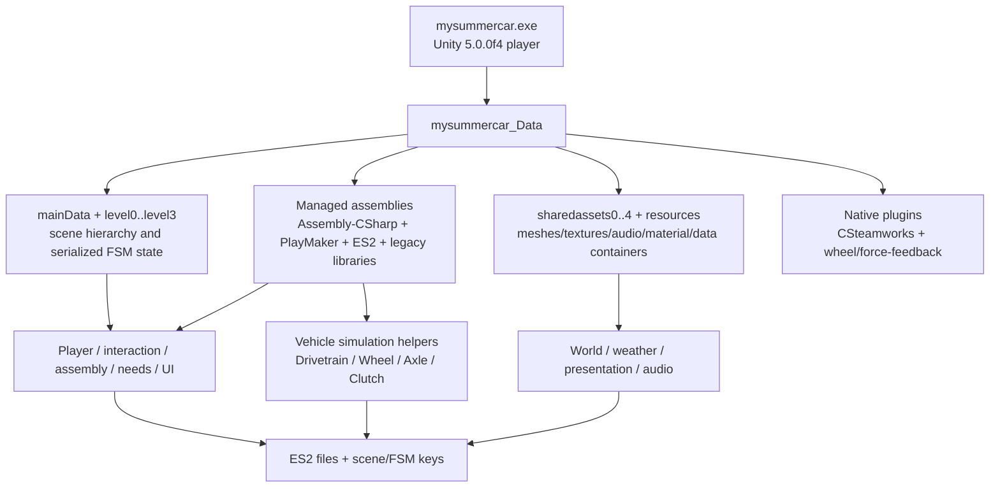

`mysummercar_Data\Unity_Assets_Files`, `Mods`, loader DLLs, and dated folders are outside the trusted source flow. They are pre-existing contamination/derived evidence and require clean-install comparison.

## Observed donor ownership map

| Area | Observed source owner | Inputs | Outputs/state | Failure/coupling observations |
|---|---|---|---|---|
| Scene/bootstrap | `mainData`, `level*`, PlayMaker FSM data | Player/menu events, scene loads | Active scene, object graph, global FSMs | Scene-name and object-name coupling is expected; level mapping unresolved |
| Player/input | Mouse-look components, `cInput`, PlayMaker input actions | Legacy input axes/buttons, camera state | Transform/rigidbody movement, look state, FSM events | Old input and scene/FSM dependencies; rewrite |
| Interaction | Serialized FSMs plus raycast/drag actions | Camera ray, rigidbody target, input | Held/placed object and events | No domain interface observed; likely name/event driven |
| Vehicle assembly | Serialized part hierarchies/FSMs | Part/tool contacts, object transforms | Installation/fastener state | No managed assembly graph identified; very high scene coupling |
| Vehicle powertrain | `Drivetrain`, `Clutch`, powered `Wheel`/`Axle` state | Throttle, clutch, gear, RPM, timestep | Torque, RPM, wheel impulse, fuel use | Useful formulas may exist inside a large Unity-coupled controller |
| Tire/suspension | `Wheel`, `CarDynamics`, `Axle`, `TireParameters` | Contact ray/state, chassis velocity, steering/brake | Forces, slip, suspension, skid state | Custom legacy physics; units/substep assumptions unknown |
| Damage | `CarDamage*`, `Repair`, collision callbacks | Collision force/contact, meshes | Deformed mesh and repair state | Presentation and persistent state are mixed |
| Fluids/electrical | `FuelTank` plus serialized FSM data | Time, assembly, engine demand | Fluid/electrical state and failures | Only fuel has a clear managed type; remainder unknown |
| Time/needs | Serialized GAME FSMs | Scheduled time, player actions | Needs thresholds/events | No reliable domain class observed; behavior capture required |
| World/traffic | Serialized scenes/assets and SWS paths | Time, route/spline state | Terrain/world objects, moving traffic | Layout data and gameplay state are likely mixed in the main scene |
| Weather | Rain/fog components plus serialized FSMs | Time/weather state, camera | Rain particles, fog, windshield effects | Rendering behavior is legacy-pipeline coupled |
| Audio | `MasterAudio`-style types and shared sound containers | Gameplay/FSM events, listener, RPM/environment | AudioSources/mixer/playlist state | Legacy routing and content provenance unknown |
| Animation | HOTween/iTween, IK components, FSM actions | FSM events and target transforms | Rig/transform presentation | Core state must not remain animation-event authoritative |
| UI | Menu scenes, `SettingsMenu`, PlayMaker GUI/input actions | Input, options/save state | Menus/HUD and settings events | Legacy resolution/input/FSM coupling; rewrite |
| Save/load | `ES2.dll`, `MoodkieSecurity.dll`, `UniqueSaveManager`, LocalLow files | Scene/FSM keys and object state | ES2/player-pref files | Schema and recovery behavior unknown; do not couple new runtime |

## Transfer boundary

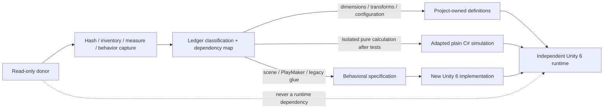

## New-runtime ownership targets

| New owner | Receives from donor | Must not receive |
|---|---|---|
| Content definitions | Verified dimensions, pivots, mount points, ratios, capacities, tables, source hashes | Donor runtime references, unverified extracted production assets |
| Plain C# simulation | Tested isolated algorithms/configuration with documented units | Giant MonoBehaviours, PlayMaker graphs, old PhysX glue |
| Runtime scene/composition | Behavioral specifications and validated layout data | Object-name lookup forests, donor scene dependencies |
| Presentation | Newly authored geometry/materials/audio/VFX aligned to measurements | Final donor textures/materials or required reference-only assets |
| Save system | Optional documented importer inputs and stable-ID mappings | Direct scene serialization or undocumented donor keys as native format |

## Concrete inspection artifacts

- File/category inventory: `E:\GAYmDev_Studio\MySummerCar_Remake_Game_DonorStaging\manifests\DONOR_FILE_INVENTORY_2026-07-13.csv`.
- Focused hashes: `E:\GAYmDev_Studio\MySummerCar_Remake_Game_DonorStaging\manifests\DONOR_RELEVANT_HASHES_2026-07-13.csv`.
- Managed file inventory: `E:\GAYmDev_Studio\MySummerCar_Remake_Game_DonorStaging\manifests\MANAGED_ASSEMBLY_INVENTORY_2026-07-13.csv`.
- Reflection-only type metadata: `E:\GAYmDev_Studio\MySummerCar_Remake_Game_LegacyReference\metadata\ASSEMBLY_CSHARP_TYPE_METADATA_2026-07-13.csv`.

## Known map gaps

- Exact `level*` to scene-name mapping.
- Serialized object/FSM hierarchy and object-to-system ownership.
- Mesh/material/animation/terrain counts and IDs.
- Vehicle part/mount/fastener graph.
- Electrical/fluid/needs/save schemas.
- Complete audio event-to-clip/mixer routing beyond the bounded Satsuma RPM/starter diagnostic mapping.
- Clean-stock comparison for the modified donor install.

## Controlled reference boundary implementation

Milestone 2 implements the metadata and validation boundary described by this map. Concrete paths, version rules, plan/execute behavior, registry/ledger ownership, build guards, and proof requirements are in `Docs/Porting/DONOR_PIPELINE.md`. The controlled proof transfers only `garage_shed_roof` and `drum_brake_rear` as `ReferenceOnly`; their independent simplified replacements are `ReauthoredGeometry`. No donor gameplay system or visual asset changed classification to `ProductionReady`.

## Milestone 3 garage world-art boundary

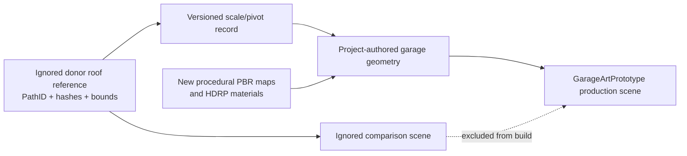

Runtime-владельцем результата является `MSC.World.Runtime`: scene marker и opt-in performance probe. Authoring, generation, metrics и validation принадлежат Editor assembly и не попадают в player. Production scene использует только rebuilt geometry/materials/textures; `ReferenceOnly` нужен лишь отдельной comparison scene.

В этом этапе donor передал только подтверждённые размеры и zero pivot крыши. Garage openings/interior, 180 m road, terrain, vegetation, lighting и atmosphere созданы заново. Это сохраняет узнаваемый масштаб без превращения donor scene hierarchy, old Unity runtime или визуальных assets в runtime dependency.

## Milestone 4 clean-room interaction boundary

Milestone 4 не использует donor gameplay data. Новый runtime flow полностью принадлежит проекту:

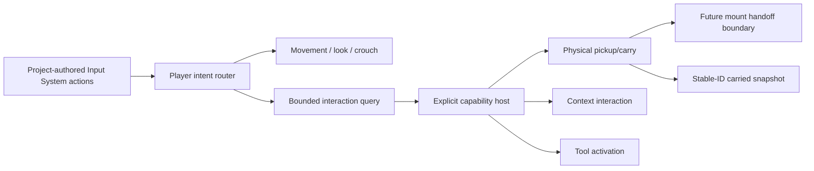

Legacy `cInput`, mouse-look components, PlayMaker actions, object-name dispatch and donor physics glue remain observational audit evidence only. They are not dependencies, ports or calibration sources for the M4 implementation.

## Milestone 04A bounded world-layout flow

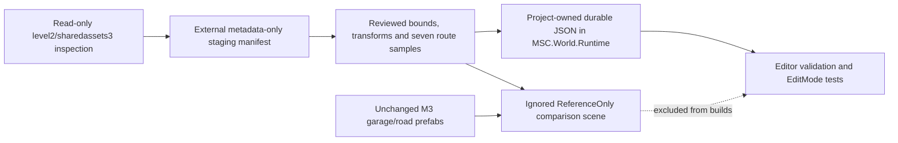

`MSC.World.Runtime` owns only serializable pilot DTOs and pure coordinate/measurement helpers. `MSC.Editor` owns local configuration access, staging hash validation, asset-dependency checks and comparison-scene generation. Production assets never depend on the ignored scene or external staging. Donor PathIDs are provenance metadata; the zone, source records and samples use project-owned stable IDs.

This map covers exactly one garage-road pilot zone. The route samples are not a complete route database or terrain centerline, and the blocked combined terrain mesh is not transferred. Player/Interaction ownership and code remain exactly as documented above.

## Milestone 04A1 full world-transfer flow

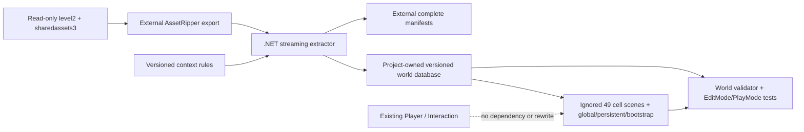

Ownership:

- `MSC.World.Runtime` — data records, coordinate conversion, partition math, landmark registry и `IWorldStreamingService` implementation;
- `MSC.Editor` — configuration, validation, cell generation, debug window и menu commands;
- external `.NET 8` tool — AssetRipper YAML normalization без Unity dependency;
- `LegacyImport/ReferenceOnly/World/Generated` — local disposable reference presentation;
- `Docs/WorldTransfer` и world database — durable audit/source of truth.

Runtime assemblies не ссылаются на Editor assemblies. Generated loader disabled в reference bootstrap, поскольку ignored cell scenes не входят в normal Build Settings; Editor overview открывает выбранные cells additively.

## Milestone 04B reference capture flow

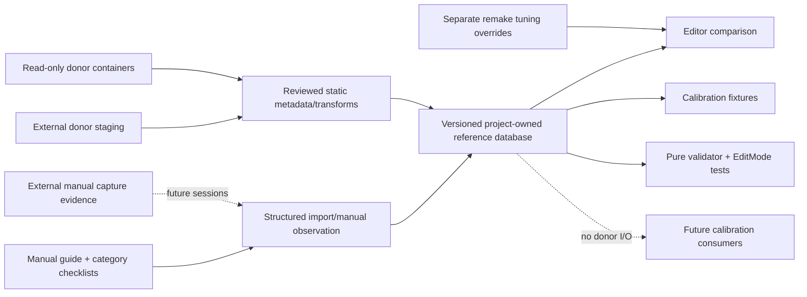

Ownership:

- `MSC.Core.Runtime` — schema, stable IDs, units, migration, querying and validation;
- `MSC.Editor` — dashboard, import/manual authoring, evidence path resolution and project validation;
- project JSON/CSV/Markdown — durable diffable truth and capture queue;
- external staging/reference storage — donor representations and future raw media;
- future vehicle/weather/audio/UI systems — consumers of validated fixtures only, not implemented in 04B.

The database can be loaded without donor assets. Machine paths remain in ignored local configuration, evidence payload stays external and runtime assemblies do not reference Editor assemblies.

Dataset `04B.4` adds only a bounded behavioral specification for the representative rear-left drum: trigger/candidate identity, Trailarm prerequisites, wheel-state removal gate, serialized `0..8` fastener stages, wrench `14`, scroll direction, three clean runtime repetitions and a user-confirmed wheel-installed blocker. It does not add a donor FSM runtime, assembly implementation or production prefab. Both M05 assembly gates are `Covered`; physical torque is intentionally not inferred from the discrete donor contract.

## Milestone 05 clean-room assembly flow

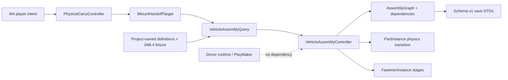

The assembly runtime uses project-owned stable/definition/mount IDs. Compatibility and blockers are data-driven; donor object names are not dispatch keys. Editor owns content generation, validation, dependency visualization and reports. The production prototype dependency graph excludes all donor/reference-only payload.

## Milestone 05A world-production flow

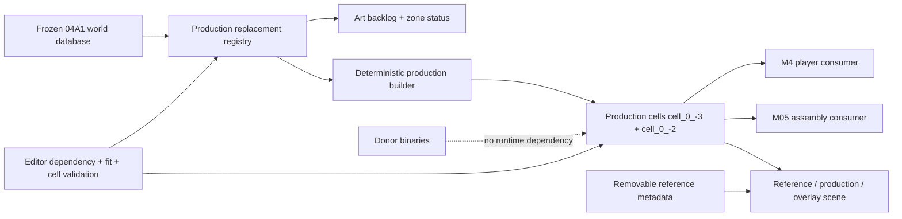

`MSC.World.Remaster.Runtime` owns serializable registry data and runtime comparison/hinge presentation. `MSC.World.Remaster.Editor` owns content generation, report generation, dashboard, capture and validation. The source database remains authoritative for identities/cells; generated scene state is never copied back into it.

Batch 01 adds `cell_0_-2 / HomeShorelinePier` as an independent streaming cell. The accepted `cell_0_-3` prefab is present only as context in Batch 01 playtest/comparison scenes; the new production-cell has no cross-cell hierarchy dependency.

## Milestone 05C1 bounded safety-topology flow

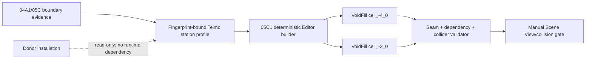

`WorldVoidFillMarker` belongs to `MSC.World.Remaster.Runtime` and carries only
project-owned region/piece/cell identity and audit metadata. Mesh generation,
reference overlay and validation stay in `MSC.Editor`; generated scenes contain
no Editor component and remain outside normal Build Settings after 05B; runtime
integration remains explicitly open as `WORLD-STREAM-005`.

## Milestone 05B validation flow

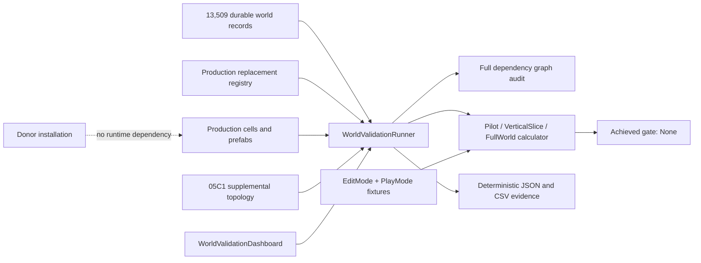

`MSC.World.Remaster.Editor` owns aggregation, dashboard and export. Runtime world,
Player and Interaction architecture remain unchanged. Direct additive lifecycle
tests exercise scene integrity, while the missing production streaming-service
boundary is kept as a blocker rather than represented by the reference loader.

## Milestone 06 clean-room simulation flow

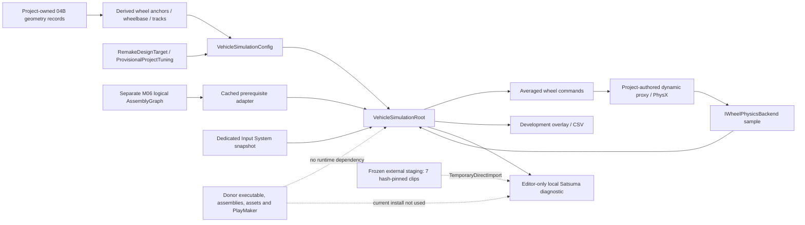

`MSC.Vehicle.Simulation` owns the model and contracts; `MSC.Vehicle.Runtime` owns Unity input, composition, PhysX, reset and presentation, including `VehicleAudioPresenter`; `MSC.Vehicle.Assembly` remains authority for part/mount/fastener state; `MSC.Audio.Runtime` owns `IVehicleAudioBackend`; `MSC.Audio.UnityFallback` owns the Editor-only `UnityAudioBackend`; `MSC.Editor` owns builders and validators.

The powertrain graph exposes generic `LeftDrivenWheel` / `RightDrivenWheel` nodes. Config indices map the single differential pair into the four-wheel array; the current authored asset selects FL/FR (`0/1`), so the prototype is presently FWD, and focused coverage verifies a `2/3` remap. AWD/multiple driven pairs remain future work. The current FWD selection is a project decision for the target vehicle; the missing donor dynamic fixture means its numeric torque, grip and response values remain provisional.

The M06 logical graph is not the dynamic proxy. Assembly state supplies availability only, while physical mass/center of mass remain provisional and uncoupled. The vehicle-owned surface markers on the bounded route do not classify production colliders and cannot close `WORLD-COL-003`.

The first manual drive confirmed the start/shift/stall/RPM loop but exposed about `5 km/h` startup creep and a shaking environment. Runtime ownership did not change: the backend now initializes suspension history without a synthetic first-sample damper impulse, uses gravity-plane speed, bounds passive correction against overshoot and performs level-only startup settling; a detached smoothed camera owns view stabilization. Focused PlayMode passes `4/4`: a six-degree slope is not pinned and a later external `WakeUp()` plus `0.05 m/s` is not re-slept. The user accepted the bounded post-remediation drive/audio recheck on 2026-07-16.

The local audio branch is diagnostic presentation only. It consumes simulation telemetry and engine state at `FixedUpdate` without becoming authoritative; PlayMode asserts `StarterEngaged -> StarterDisengaged -> EngineStarted`. Seven clips remain in frozen external staging with ledgered hashes and classification `TemporaryDirectImport`; the static `GAME.unity` RPM/starter routing evidence is `ReferenceOnly`. Nothing enters Git, production `Assets` or a build. Missing staging remains a silent fallback, the current mod-contaminated/hash-drift donor install is not used, no stop/stall parity clip is claimed, and final audio remains reauthored behind `IAudioBackend`.

Only exact reviewed geometry crosses from the reference database. Donor dynamic fixtures are `Missing`, so every dynamic constant follows the project-authored tuning path. The isolated method/allocation audit passes, but Unity `Physics.Processing` evidence remains unavailable until a later player/Profiler capture. The automated M06 gate passes with focused PlayMode `4/4` and full PlayMode `31/31`; bounded manual acceptance is recorded. M06A has not begun.
