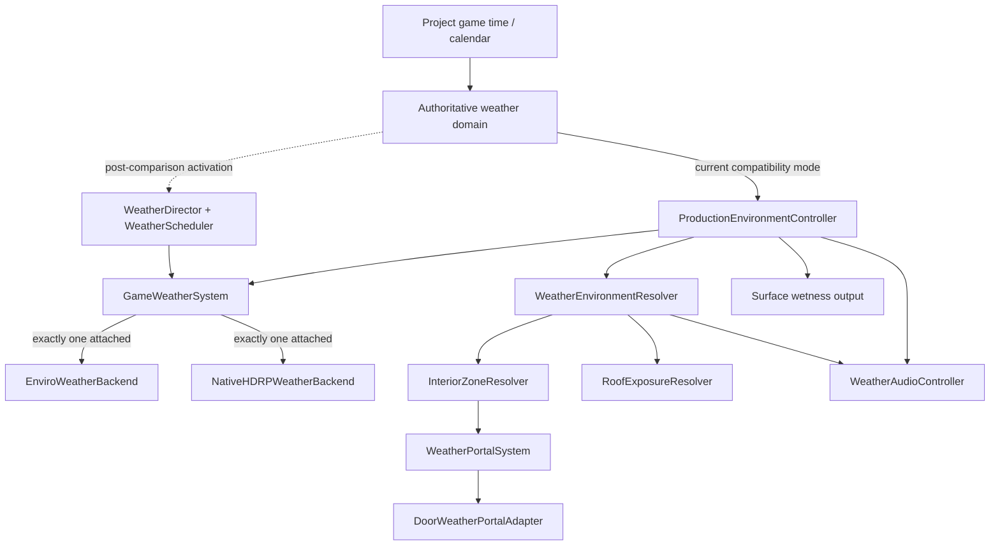

# Weather System Architecture

## Status and compatibility boundary

The weather-system code is implemented as a staged, reversible extension of the
accepted 00–08A environment foundation. `ProductionEnvironmentController`
remains the active game-time, weather, lightning, wetness, and native-save
authority until a scene is explicitly migrated and its comparison gate is
approved. Enviro 3 remains installed and preserved.

The new domain model is vendor-neutral and executable independently. The
compatibility facade accepts the existing `EnvironmentPresentationFrame`, so the
current production authority can drive either presentation backend without
gameplay code referencing Enviro or HDRP types.

## Assembly boundaries

| Assembly | Responsibility | Vendor dependency |
|---|---|---|
| `MSC.Weather.System.Runtime` | Continuous state, presets, deterministic scheduling, transitions, wetness, save snapshot, backend router, debug data | None |
| `MSC.Weather.System.Local.Runtime` | Interior zones, legacy-zone adapter, two-sided portals, roof exposure, local context | None |
| `MSC.Weather.System.Audio.Runtime` | Rate-limited `IAudioBackend` weather output | None |
| `MSC.Weather.System.EnviroLegacy.Runtime` | Thin delegate around the accepted Enviro adapter | Enviro isolated here |
| `MSC.Weather.System.NativeHDRP.Runtime` | Native HDRP sky/cloud/fog/exposure/sun/precipitation presentation | HDRP only |
| `MSC.Weather.System.Editor` | Content builder, Undo migration, scene validator | Editor only |

Gameplay and core assemblies do not reference Enviro. Runtime assemblies do not
reference Editor code.

## Global continuous state

`WeatherState` carries all atmosphere channels as continuous values:

- cloud coverage, density, erosion, and shadow strength;
- rain, drizzle, and thunder intensity;
- fog density, visibility distance, and haze;
- SI wind speed, normalized XZ direction, and gustiness;
- surface wetness and puddle amount;
- sun visibility, sky brightness, and ambient-light multiplier;
- Celsius temperature and normalized humidity.

`WeatherTransitionController` blends every channel. Channel families have
separate curves, so precipitation can lag cloud build-up while fog, wind,
lighting, climate, and surface state remain continuous. There is no authoritative
`isRaining` or `isIndoor` boolean.

## Finnish summer climate

`FinnishSummerClimateProfile` and the generated content contain exactly these 16
states:

1. ClearCool
2. PartlyCloudy
3. MostlyCloudy
4. BrightOvercast
5. HeavyOvercast
6. MorningMist
7. LakeMist
8. LightDrizzle
9. LightRain
10. SteadyRain
11. HeavyRain
12. RareThunderstorm
13. PostRainWet
14. ClearingAfterRain
15. ColdClearEvening
16. BlueHour

The authored successor graph prevents direct `ClearCool → HeavyRain`,
`HeavyRain → ClearCool`, and `LakeMist → ClearCool` changes. A thunderstorm has
one predecessor: `HeavyRain`. Scheduler weights combine month, time window,
temperature, humidity, authored probability, rarity, and a fixed-size recent
history penalty.

Random selection uses a saved PCG stream. The snapshot includes current and
target IDs, front/transition elapsed time, history ring, RNG state, global
continuous state, wetness/puddles, and thunder sub-state. Restore is validated
and atomic.

## Backend ownership

`GameWeatherSystem` is the exclusive presentation router. Switching backends:

1. detaches the previous backend;
2. attaches the requested backend;
3. replays the most recent presentation frame;
4. restores the previous backend if attach fails.

`EnviroWeatherBackend` delegates to the accepted adapter. In the production
hybrid route it owns time, celestial sky, sun/moon, stars, clouds,
precipitation, wind and visual lightning, while `NativeHdrpWeatherBridge` owns
Fog, Exposure and Indirect Lighting; the backend's ownership flags omit those
three bridge-owned channels.
`NativeHDRPWeatherBackend` owns one dedicated global Volume and the authored sun.
It clones the Volume profile at runtime, caches all overrides, and never mutates
a shared profile. When native ownership is attached it reversibly suspends the
configured legacy weather Volumes and presentation owners. Detach restores every
captured enabled state, profile, Volume weight, sun value, and particle setting.

The native backend controls:

- `VisualEnvironment` and `PhysicallyBasedSky`;
- `VolumetricClouds`, cloud shadows, and wind orientation/speed;
- one `Fog` owner;
- fixed, camera-independent `Exposure` bounded by authored EV limits;
- `WhiteBalance`, restrained `ColorAdjustments`, ACES tonemapping, and indirect
  lighting;
- a geography-driven directional sun using a deterministic NOAA-style solar
  approximation;
- optional project-owned rain/drizzle particle arrays and lightning flash.

When `WeatherEnvironmentResolver` is assigned, Native HDRP consumes its
continuous local context directly: fog attenuation, precipitation exposure,
outdoor/indirect-light influence, and authored EV compensation remain
independent. Without that source it falls back to the accepted coarse
`Exterior`/`Sheltered`/`Interior` presentation context for compatibility.

No second sun, fog, cloud, or exposure owner is permitted while Native HDRP is
attached. Missing precipitation particles produce a degraded warning rather
than silently pretending visual parity.

## Local environment and portals

`LocalWeatherContext` keeps independent values for outdoor, precipitation, fog,
wind, exterior audio, audio leakage, thunder, roof exposure, interior depth,
door transmission, and exposure compensation.

`InteriorZone` uses an `EnvironmentZoneProfile`. Existing accepted
`WeatherZone` components are retained and exposed through
`LegacyWeatherZoneAdapter`; their stable ID, collider geometry, priority, and
authored exposure values remain authoritative.

`WeatherPortalSystem` treats `null` as the stable Outdoor node. Every
`IEnvironmentPortal` has two endpoints and six separate transmission channels.
It computes the maximum-product path from Outdoor for every channel. Different
channels may therefore use different strongest paths through a multi-room
building. The graph rebuilds only after a zone/portal registers, unregisters, or
changes transmission.

`DoorWeatherPortalAdapter` polls the accepted `HingedDoorInteractionTarget` at a
bounded 10 Hz and derives open/opening/ajar/closing/closed events without
modifying the door API. Visual, audio, wind, fog, precipitation, and thunder use
different nonlinear curves. Opening area limits each channel, so a small future
window does not transmit like a full-size door. Listener distance, interior
depth, and alignment with the portal normal shape the local result; sequential
doors attenuate multiplicatively in the graph. A closed door deliberately leaks
some weather audio and more low-frequency thunder while blocking precipitation.

`RoofExposureResolver` performs five `RaycastNonAlloc` samples after its interval
or meaningful listener movement. `WeatherEnvironmentResolver` combines roof and
zone results, so precipitation is blocked under a roof without flattening fog,
wind, exposure, and audio to the same value.

`VehicleLocalWeatherContext` is separate from the building graph. It consumes
future doors/windows through the same `IEnvironmentPortal` contract, preserves a
distinct cabin-listener rain exposure and body-rain exposure, and lets the
existing vehicle audio state remain authoritative.

Streaming is registration-based. Loading a cell registers its zones and
portals; unloading removes only those nodes. Global scheduler, wetness, RNG, and
save state do not live in a streamed scene and are not reset.

## Wetness and future water integration

`SurfaceWetnessController` separates current precipitation from accumulated
wetness and puddles. Drying depends on temperature, wind, sun visibility, cloud
cover, humidity, and preset drying multiplier. It implements no lake/ocean
asset dependency.

`SurfaceWetnessShaderOutput` reuses the accepted project shader globals:

- `_MSC_GroundWetness`
- `_MSC_RoadWetness`
- `_MSC_PuddleAmount`
- `_MSC_VegetationWetness`

Optional local overrides use one cached `MaterialPropertyBlock`; no
`renderer.material` instances are created. A future water system can consume
the domain output through `ISurfaceWetnessOutput` without changing simulation.

## Update and allocation policy

The hot paths use fixed arrays/lists, cached components, bounded polling, and
non-alloc raycasts. Profiler markers are:

- `Weather.Update`
- `Weather.Transition`
- `Weather.ZoneResolve`
- `Weather.PortalGraph`
- `Weather.RoofResolve`
- `Weather.WwiseUpdate`
- `Weather.SurfaceWetness`
- `Weather.HDRPApply`

The scheduler steady-state allocation contract is covered by an EditMode test.
Scene CPU/GPU comparison still requires a migrated representative build; no
synthetic editor number is presented as production profiling data.

## Production activation

As of 2026-08-12, `Assets/Game/Bootstrap/Bootstrap.unity` selects
`WeatherBackendType.NativeHDRP`. `ProductionEnvironmentController` remains the
single time/weather/wetness/lightning authority and consumes the 16-state
Finnish summer catalog through `FinnishSummerProductionCatalogAdapter`.

The accepted domain scheduler now performs climate-aware weighted selection
directly: authored graph, month/time eligibility, temperature, humidity,
rarity, precipitation bias and a six-front repeat guard. This avoids a second
parallel scheduler. Weather DTO schema v2 stores the history ring; v1 restores
the active front and RNG, seeds the new repeat guard from the current state, and
is written as v2 on the next capture.

The weather facade, native Volume, precipitation emitters, lightning flash,
local resolvers and streaming bridge live below `GameCompositionRoot`, so
additive world-cell churn cannot recreate or reset global weather.
